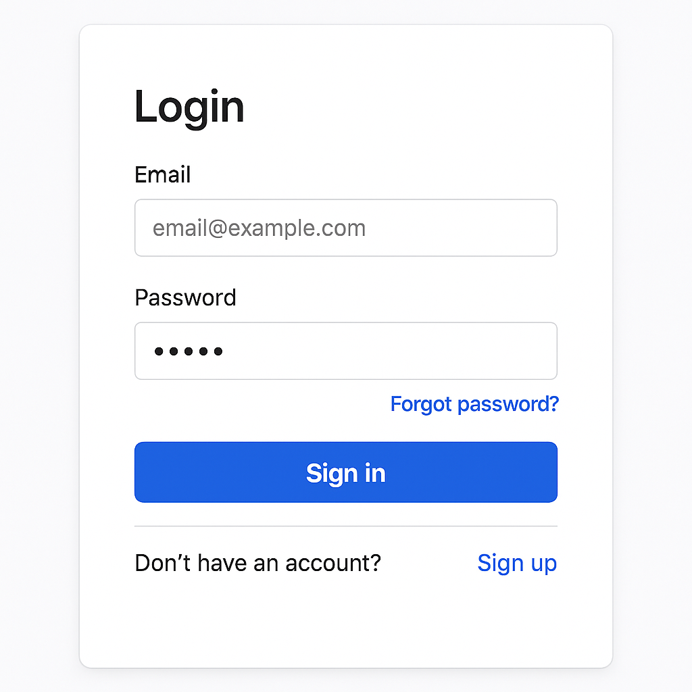
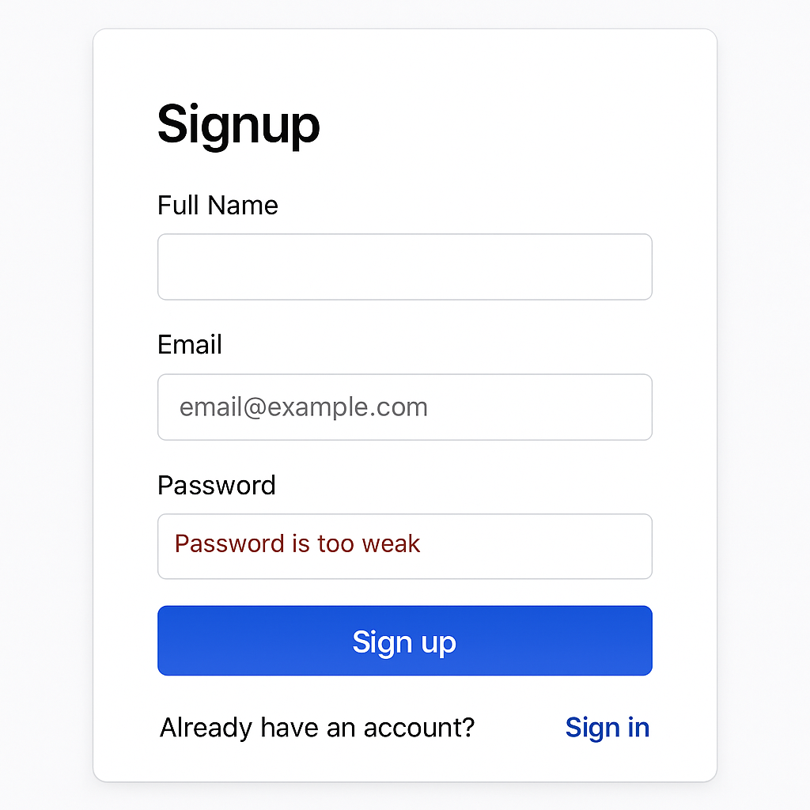

# Day 1: Login & Signup UI

## 📚 Table of Contents

- [Setup](#setup)
- [Goal](#-goal)
- [Learning Outcomes](#-learning-outcomes)
- [Preview](#-preview)
- [Tasks](#-tasks)
- [Bonus Challenge](#-bonus-challenge)
- [Deliverable](#-deliverable)
- [Getting Started](#-getting-started)
- [Folder Structure](#-folder-structure)
- [Document Your Bonus Improvement](#-document-your-bonus-improvement)

---

## 🚀 Setup

Follow these steps to set up both the Flask backend and React frontend for this module:

### 1. Backend (Flask)

1. Open a terminal and navigate to the backend folder:
   ```bash
   cd ../../app/backend
   ```
2. (Optional) Create and activate a virtual environment:
   ```bash
   python3 -m venv venv
   source venv/bin/activate
   ```
3. Install dependencies:
   ```bash
   pip install -r requirements.txt
   ```
4. Start the Flask server:
   ```bash
   flask run
   ```
   The backend will run at [http://localhost:5000](http://localhost:5000)

### 2. Frontend (React)

1. Open a new terminal and navigate to the frontend folder:
   ```bash
   cd ../../app/frontend
   ```
2. Install dependencies:
   ```bash
   npm install
   ```
3. Start the React development server:
   ```bash
   npm start
   ```
   The frontend will run at [http://localhost:3000](http://localhost:3000)

### 3. Free Hosting (Deploy Your App)

- **Frontend (React):**
  - [Vercel](https://vercel.com/) and [Netlify](https://www.netlify.com/) both support free React app hosting. Connect your GitHub repo and follow their deploy instructions.
- **Backend (Flask):**
  - [Render](https://render.com/) and [Railway](https://railway.app/) offer free Flask backend hosting. Push your backend code to a separate repo or subfolder and follow their setup guides.
- **Free MySQL Database:**
  - [PlanetScale](https://planetscale.com/) and [Clever Cloud](https://www.clever-cloud.com/) offer free MySQL hosting tiers. You can connect your Flask backend to these services by updating your database URI in the backend config.

💡 **Pro Tip:** Always check the latest free tier limits and documentation for each service!

---

## 🎯 Goal

Build the **Login & Signup UI** module of the Prok Professional Networking app. This module focuses on creating the user interface for authentication screens.

## 📚 Learning Outcomes

- Understand the basics of authentication UI design.
- Implement clean and modern login and signup forms using React and Tailwind CSS.
- Learn best practices for component structure, form validation, and user experience.

## 📸 Preview

**Login Screen:**



**Signup Screen:**

 

## 🛠️ Tasks

1. **Setup the Project**
   - Navigate to the `day1-login-&-signup-ui` folder.
   - Install frontend dependencies:
     ```bash
     cd frontend
     npm install
     ```
2. **Frontend Implementation**
   - Build login and signup forms as React components.
   - Add form validation for user input (email, password, etc.).
   - Implement error messages and loading states for better UX.
3. **Testing**
   - Test the UI for usability and responsiveness.
   - Ensure all form states (valid, invalid, loading) are handled.

## 🧪 Bonus Challenge

- Add an extra improvement, such as:
  - Enhanced styling for forms and buttons.
  - Password visibility toggle.
  - Improved UX flow (e.g., transitions, focus states).
- Document your improvement in your own words at the end of this README.

## ✅ Deliverable

A working login and signup UI with a clean design, pushed to GitHub in the `/final` folder.

---

## 🚀 Getting Started

### Prerequisites

- Node.js and npm

### Setup Steps

1. **Clone the repository**
   ```bash
   git clone <repo-url>
   cd day1-login-&-signup-ui
   ```
2. **Install dependencies**
   ```bash
   cd frontend
   npm install
   ```
3. **Run the application**
   ```bash
   cd frontend
   npm start
   ```
4. **Access the app**
   - Open your browser and go to `http://localhost:3000`.

---

## 🗂️ Folder Structure

```
day1-login-&-signup-ui/
  README.md
  starter/       # Starter code and assets
  final/         # Your completed solution goes here
```

---

## 📝 Document Your Bonus Improvement

Describe your bonus improvement here. For example:

> **Bonus Improvement:** Added a password visibility toggle to the login and signup forms for better usability.

---

If you have any questions or need help, feel free to open an issue or reach out to the instructor.

---
