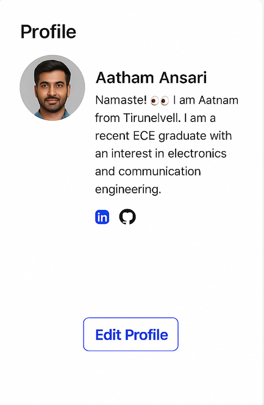
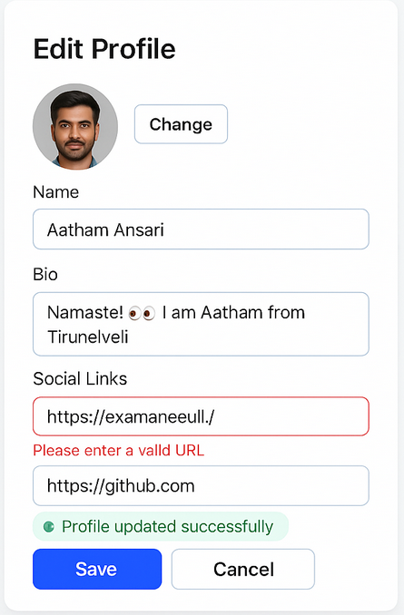

# Day 3: Profile Page

## 🎯 Goal

Build the **Profile Page** module of the Prok Professional Networking app. This module covers both frontend and backend for user profile display and editing.

## 📚 Learning Outcomes

- Understand the core concepts of user profile management in web applications.
- Implement a clean and modern UI for profile viewing and editing using React and Tailwind CSS.
- Integrate frontend components with a Flask backend API.
- Learn best practices for component separation, API usage, and secure data handling.
- Connect the backend to a MySQL database for persistent user profile storage.

## 📸 Preview




## 🛠️ Tasks

1. **Setup the Project**

   - Clone the repository and navigate to the `day2-profile-page` folder.
   - Install frontend dependencies in the `frontend` directory:
     ```bash
     cd frontend
     npm install
     ```
   - Install backend dependencies in the `backend` directory:
     ```bash
     cd backend
     pip install -r requirements.txt
     ```

2. **Frontend Implementation**

   - Build profile view and edit forms using React and Tailwind CSS.
   - Add form validation for user input (name, bio, etc.).
   - Connect forms to backend APIs using fetch/axios.
   - Display error messages and loading states for better UX.

3. **Backend Implementation**

   - Create Flask API endpoints for `/profile` (GET, POST, PUT).
   - Use models (e.g., `user.py`) to interact with the database.
   - Implement authentication and secure profile updates.
   - Return appropriate responses and error codes.

4. **Database Integration**

   - Set up a MySQL database for user profile storage.
   - Ensure user data is stored securely and can be retrieved/updated.

5. **Testing**
   - Test the full profile flow: view, edit, error handling.
   - Ensure the UI updates correctly based on API responses.

## ✅ Deliverable

A working profile page module with a clean UI and functional backend, pushed to GitHub in the `/final` folder.

---

## 🚀 Getting Started

### Prerequisites

- Node.js and npm
- Python 3.x and pip
- MySQL

### Setup Steps

1. **Clone the repository**
   ```bash
   git clone <repo-url>
   cd day2-profile-page
   ```
2. **Install dependencies**
   - Frontend:
     ```bash
     cd frontend
     npm install
     ```
   - Backend:
     ```bash
     cd backend
     pip install -r requirements.txt
     ```
3. **Run the applications**
   - Start the backend server:
     ```bash
     cd backend
     flask run
     ```
   - Start the frontend development server:
     ```bash
     cd frontend
     npm start
     ```
4. **Access the app**
   - Open your browser and go to `http://localhost:3000` for the frontend.
   - Backend API runs on `http://localhost:5000` by default.

---

## 🗂️ Folder Structure

```
day2-profile-page/
  README.md
  final/         # Your completed solution goes here
  starter/       # Starter code and assets
  backend/       # Flask backend code
    app.py
    requirements.txt
    models/
      user.py
  frontend/      # React frontend code
    package.json
    src/
      index.jsx
```

---

If you have any questions or need help, feel free to open an issue or reach out to the instructor.

---
