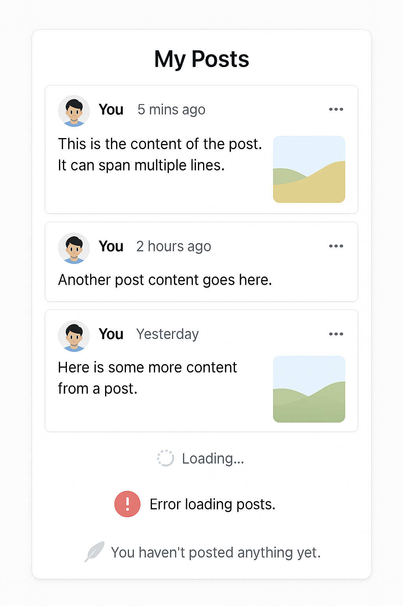

# Day 6: My Posts Listing and Details

## 🎯 Goal

Build the **My Posts** module of the Prok Professional Networking app. This module focuses on displaying a list of posts created by the logged-in user, showing post details (text, images, author, timestamp), and rendering them in a modern, user-friendly format.

## 📚 Learning Outcomes

- Fetch and display only the logged-in user's posts from the backend API.
- Render post details: text, images, author, timestamp, etc.
- Implement a clean and modern UI for a user's post list using React and Tailwind CSS.
- Handle loading, error, and empty states gracefully.
- (Optional) Support pagination or infinite scroll for large numbers of posts.

## 📸 Preview



## 🛠️ Tasks

1. **Setup the Project**

   - Clone the repository and navigate to the `06-posts` folder.
   - Install frontend dependencies in the `frontend` directory:
     ```bash
     cd frontend
     npm install
     ```
   - Install backend dependencies in the `backend` directory:
     ```bash
     cd backend
     pip install -r requirements.txt
     ```

2. **Frontend Implementation**

   - Build a component to display only the logged-in user's posts using React and Tailwind CSS.
   - Fetch posts from the backend where the author matches the current user.
   - Show post details: text, images, author, timestamp, etc.
   - Handle loading spinners, error messages, and empty states (e.g., no posts yet).
   - (Optional) Implement pagination or infinite scroll for large lists.

3. **Backend Implementation**

   - Create Flask API endpoints for `/posts` (GET) that filter posts by the logged-in user (e.g., using authentication/session info).
   - Use models (e.g., `post.py`) to interact with the database.
   - Ensure each post includes necessary details (text, images, author, timestamp).
   - (Optional) Support pagination in the API.

4. **Testing**
   - Test the list with multiple posts, no posts, and error scenarios.
   - Ensure the UI updates correctly based on API responses.

## ✅ Deliverable

A working module that lists only the logged-in user's posts with a clean UI and functional backend, pushed to GitHub in the `/final` folder.

---

## 🚀 Getting Started

### Prerequisites

- Node.js and npm
- Python 3.x and pip

### Setup Steps

1. **Clone the repository**
   ```bash
   git clone <repo-url>
   cd 06-posts
   ```
2. **Install dependencies**
   - Frontend:
     ```bash
     cd frontend
     npm install
     ```
   - Backend:
     ```bash
     cd backend
     pip install -r requirements.txt
     ```
3. **Run the applications**
   - Start the backend server:
     ```bash
     cd backend
     flask run
     ```
   - Start the frontend development server:
     ```bash
     cd frontend
     npm start
     ```
4. **Access the app**
   - Open your browser and go to `http://localhost:3000/my-posts` to view your posts.
   - Backend API runs on `http://localhost:5000` by default.

---

## 🗂️ Folder Structure

```
06-posts/
  README.md
  final/         # Your completed solution goes here
  starter/       # Starter code and assets
  backend/       # Flask backend code
    app.py
    requirements.txt
    models/
      post.py
  frontend/      # React frontend code
    package.json
    src/
      index.jsx
```

---

If you have any questions or need help, feel free to open an issue or reach out to the instructor.

---
