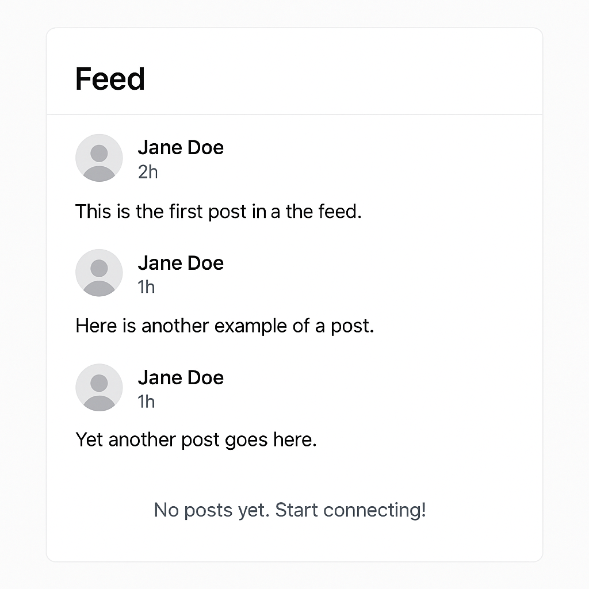

# Day 7: Basic Feed

## 🎯 Goal

Build the **Basic Feed** module of the Prok Professional Networking app. This module introduces the concept of a feed—a stream of content (such as posts) for the user. The focus here is on layout and structure, using static or mock data, without advanced features like comments or likes.

## 📚 Learning Outcomes

- Understand the concept of a feed in social/professional networking apps.
- Implement a basic feed layout using React and Tailwind CSS.
- Render a list of static or mock posts (no backend integration required).
- Practice UI composition and responsive design.
- Prepare for more advanced feed features in later modules.

## 📸 Preview



## 🛠️ Tasks

1. **Setup the Project**

   - Clone the repository and navigate to the `07-feed` folder.
   - Install frontend dependencies in the `frontend` directory:
     ```bash
     cd frontend
     npm install
     ```

2. **Frontend Implementation**

   - Build a feed component that displays a list of posts using static or mock data.
   - Focus on layout, card design, and responsive UI.
   - Show post details: text, author, timestamp (use placeholder data).
   - Do not implement comments, likes, or backend integration yet.
   - Handle empty state (e.g., show a message if there are no posts).

3. **(Optional) Styling**

   - Enhance the look and feel of the feed with Tailwind CSS.
   - Add placeholder images or avatars for posts.

4. **Testing**
   - Test the feed with several mock posts and with no posts.
   - Ensure the layout is responsive and visually appealing.

## ✅ Deliverable

A working basic feed module with a clean, static UI, pushed to GitHub in the `/final` folder.

---

## 🚀 Getting Started

### Prerequisites

- Node.js and npm

### Setup Steps

1. **Clone the repository**
   ```bash
   git clone <repo-url>
   cd 07-feed
   ```
2. **Install dependencies**
   - Frontend:
     ```bash
     cd frontend
     npm install
     ```
3. **Run the application**
   - Start the frontend development server:
     ```bash
     cd frontend
     npm start
     ```
4. **Access the app**
   - Open your browser and go to `http://localhost:3000/feed` to view the basic feed.

---

## 🗂️ Folder Structure

```
07-feed/
  README.md
  final/         # Your completed solution goes here
  starter/       # Starter code and assets
  frontend/      # React frontend code
    package.json
    src/
      index.jsx
```
