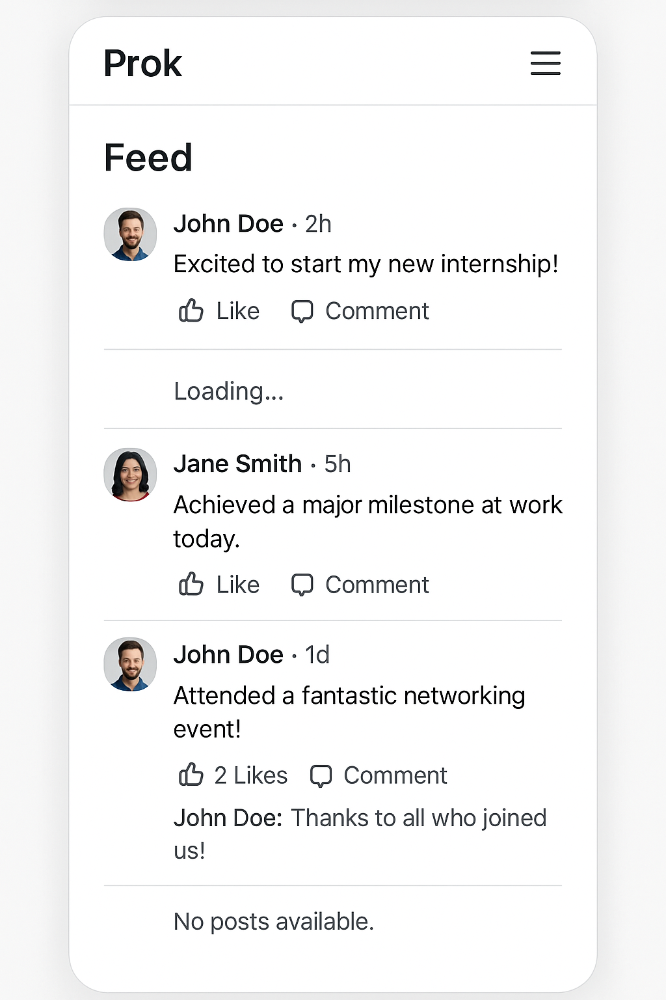

# Day 8: Feed with Posts

## 🎯 Goal

Build the **Feed with Posts** module of the Prok Professional Networking app. This module covers both frontend and backend for displaying a user's feed with posts, comments, and user engagement features.

## 📚 Learning Outcomes

- Understand the core concepts of feed aggregation and user engagement in web applications.
- Implement a clean and modern UI for the feed using React and Tailwind CSS.
- Add support for comments, likes, and other interactions.
- Integrate frontend components with a Flask backend API.
- Learn best practices for performance, error handling, and scalability.

## 📸 Preview



## 🛠️ Tasks

1. **Setup the Project**

   - Clone the repository and navigate to the `08-feed-with-posts` folder.
   - Install frontend dependencies in the `frontend` directory:
     ```bash
     cd frontend
     npm install
     ```
   - Install backend dependencies in the `backend` directory:
     ```bash
     cd backend
     pip install -r requirements.txt
     ```

2. **Frontend Implementation**

   - Build feed components to display posts, comments, and likes.
   - Add UI for commenting, liking, and (optional) sharing posts.
   - Handle loading, error, and empty feed states.
   - Connect components to backend APIs using fetch/axios.
   - Display user avatars, timestamps, and post content.

3. **Backend Implementation**

   - Create Flask API endpoints for `/feed`, `/posts`, `/comments`, `/likes` (GET, POST, DELETE).
   - Use models to interact with the database for posts, comments, and likes.
   - Implement authentication and secure feed management.
   - Return appropriate responses and error codes.

4. **Database Integration**

   - Set up a database (e.g., SQLite or PostgreSQL) for feed, post, and comment storage.
   - Ensure data is stored securely and can be retrieved/updated efficiently.

5. **Testing**
   - Test the full feed flow: display, comment, like, error handling.
   - Ensure the UI updates correctly based on API responses.

## ✅ Deliverable

A working feed module with a clean UI, user engagement features, and a functional backend, pushed to GitHub in the `/final` folder.

---

## 🚀 Getting Started

### Prerequisites

- Node.js and npm
- Python 3.x and pip

### Setup Steps

1. **Clone the repository**
   ```bash
   git clone <repo-url>
   cd 08-feed-with-posts
   ```
2. **Install dependencies**
   - Frontend:
     ```bash
     cd frontend
     npm install
     ```
   - Backend:
     ```bash
     cd backend
     pip install -r requirements.txt
     ```
3. **Run the applications**
   - Start the backend server:
     ```bash
     cd backend
     flask run
     ```
   - Start the frontend development server:
     ```bash
     cd frontend
     npm start
     ```
4. **Access the app**
   - Open your browser and go to `http://localhost:3000` for the frontend.
   - Backend API runs on `http://localhost:5000` by default.

---

## 🗂️ Folder Structure

```
08-feed-with-posts/
  README.md
  final/         # Your completed solution goes here
  backend/       # Flask backend code
    app.py
    requirements.txt
    models/
      post.py
      comment.py
  frontend/      # React frontend code
    package.json
    src/
      index.jsx
```

---

If you have any questions or need help, feel free to open an issue or reach out to the instructor.

---
