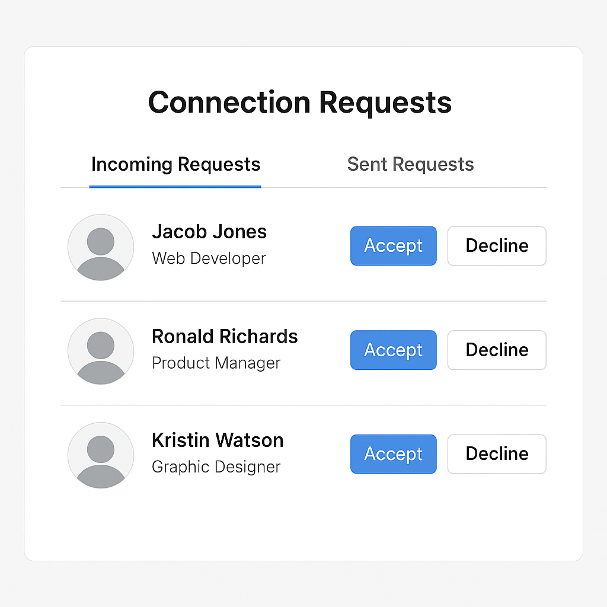

# Day 9 Connection Requests

## 🎯 Goal

Build the **Connection Requests** module of the Prok Professional Networking app. This module focuses on handling incoming and outgoing connection requests—allowing users to send, view, accept, or decline requests from other users.

## 📚 Learning Outcomes

- Understand the flow of connection requests in a networking platform.
- Implement a UI for sending, accepting, and declining requests using React and Tailwind CSS.
- Display pending requests (sent and received, not yet accepted/declined).
- Integrate frontend components with backend endpoints for managing requests.
- Learn best practices for user relationship management and real-world data flows.

## 📸 Preview



## 🛠️ Tasks

1. **Setup the Project**

   - Clone the repository and navigate to the `09-connection-requests` folder.
   - Install frontend dependencies in the `frontend` directory:
     ```bash
     cd frontend
     npm install
     ```
   - Install backend dependencies in the `backend` directory:
     ```bash
     cd backend
     pip install -r requirements.txt
     ```

2. **Frontend Implementation**

   - Build UI components for sending, accepting, and declining connection requests.
   - Display lists of pending requests (sent and received).
   - Show clear feedback for actions (success, error, loading states).

3. **Backend Integration**

   - Connect to backend endpoints for managing requests (send, accept, decline).
   - Ensure proper authentication and error handling.

4. **Testing**
   - Test sending, accepting, and declining requests.
   - Test UI with no requests, many requests, and error scenarios.

## 🧪 Bonus Challenge

- Add an extra improvement, such as:
  - Enhanced styling for request cards.
  - Real-time updates for new requests.
  - Improved UX flow (e.g., notifications, loading spinners).
- Document your improvement at the end of this README.

## ✅ Deliverable

A working connection requests module with a clean UI and functional backend, pushed to GitHub in the `/final` folder.

---

## 🚀 Getting Started

### Prerequisites

- Node.js and npm
- Python 3.x and pip

### Setup Steps

1. **Clone the repository**
   ```bash
   git clone <repo-url>
   cd 09-connection-requests
   ```
2. **Install dependencies**
   - Frontend:
     ```bash
     cd frontend
     npm install
     ```
   - Backend:
     ```bash
     cd backend
     pip install -r requirements.txt
     ```
3. **Run the applications**
   - Start the backend server:
     ```bash
     cd backend
     flask run
     ```
   - Start the frontend development server:
     ```bash
     cd frontend
     npm start
     ```
4. **Access the app**
   - Open your browser and go to `http://localhost:3000/connection-requests` to manage requests.
   - Backend API runs on `http://localhost:5000` by default.

---

## 🗂️ Folder Structure

```
09-connection-requests/
  README.md
  final/         # Your completed solution goes here
  backend/       # Flask backend code
    app.py
    requirements.txt
    models/
      connection.py
      user.py
  frontend/      # React frontend code
    package.json
    src/
      index.jsx
```

---

## 📝 Document Your Bonus Improvement

Describe your bonus improvement here. For example:

> **Bonus Improvement:** Added real-time notifications for new connection requests using WebSockets. This improves user engagement and responsiveness.

---

If you have any questions or need help, feel free to open an issue or reach out to the instructor.

---
