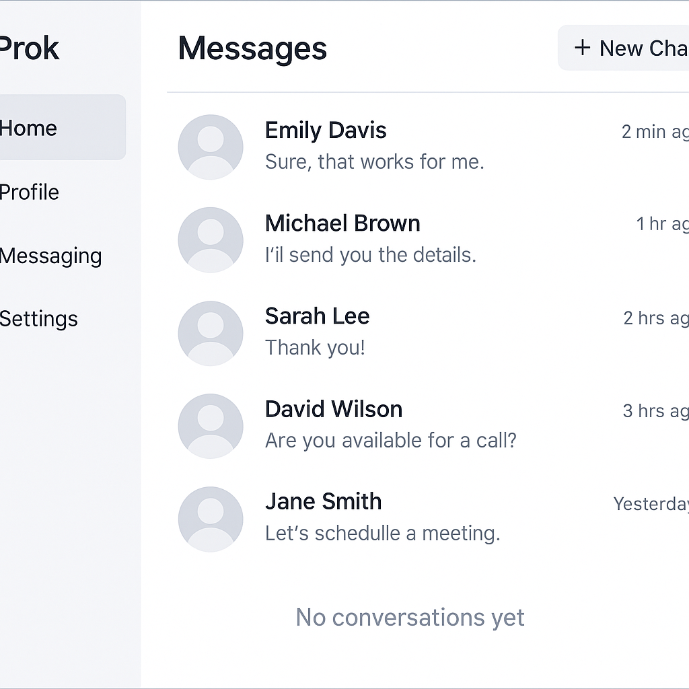

# Day 11: Messaging

## 🎯 Goal

Build the **Messaging** module of the Prok Professional Networking app. This module focuses on the overall messaging feature—setting up the infrastructure for messaging, listing conversations, starting new chats, and integrating messaging into the app’s navigation.

## 📚 Learning Outcomes

- Understand the core concepts of messaging systems in web applications.
- Implement a UI for listing all conversations or contacts using React and Tailwind CSS.
- Add the ability to start a new conversation.
- Integrate messaging navigation into the main app.
- Connect frontend components with a Flask backend API.
- Learn best practices for component separation, API usage, and secure message handling.

## 📸 Preview



## 🛠️ Tasks

1. **Setup the Project**

   - Clone the repository and navigate to the `11-messaging` folder.
   - Install frontend dependencies in the `frontend` directory:
     ```bash
     cd frontend
     npm install
     ```
   - Install backend dependencies in the `backend` directory:
     ```bash
     cd backend
     pip install -r requirements.txt
     ```

2. **Frontend Implementation**

   - Build a UI to list all conversations or contacts.
   - Add an option to start a new conversation.
   - Implement navigation to individual chat screens (but not the chat UI itself).
   - Show loading and error states for the conversation list.

3. **Backend Implementation**

   - Create Flask API endpoints for `/conversations` (GET, POST) to fetch and start conversations.
   - Use models (e.g., `conversation.py`, `user.py`) to interact with the database.
   - Implement authentication and secure conversation management.
   - Return appropriate responses and error codes.

4. **Testing**
   - Test listing conversations, starting new chats, and navigating to chat screens.
   - Ensure the UI updates correctly based on API responses.

## ✅ Deliverable

A working messaging interface module with a clean UI and functional backend, pushed to GitHub in the `/final` folder.

---

## 🚀 Getting Started

### Prerequisites

- Node.js and npm
- Python 3.x and pip

### Setup Steps

1. **Clone the repository**
   ```bash
   git clone <repo-url>
   cd 11-messaging
   ```
2. **Install dependencies**
   - Frontend:
     ```bash
     cd frontend
     npm install
     ```
   - Backend:
     ```bash
     cd backend
     pip install -r requirements.txt
     ```
3. **Run the applications**
   - Start the backend server:
     ```bash
     cd backend
     flask run
     ```
   - Start the frontend development server:
     ```bash
     cd frontend
     npm start
     ```
4. **Access the app**
   - Open your browser and go to `http://localhost:3000/messaging` to view the messaging interface.
   - Backend API runs on `http://localhost:5000` by default.

---

## 🗂️ Folder Structure

```
11-messaging/
  README.md
  final/         # Your completed solution goes here
  backend/       # Flask backend code
    app.py
    requirements.txt
    models/
      conversation.py
      user.py
  frontend/      # React frontend code
    package.json
    src/
      index.jsx
```

---

If you have any questions or need help, feel free to open an issue or reach out to the instructor.

---
