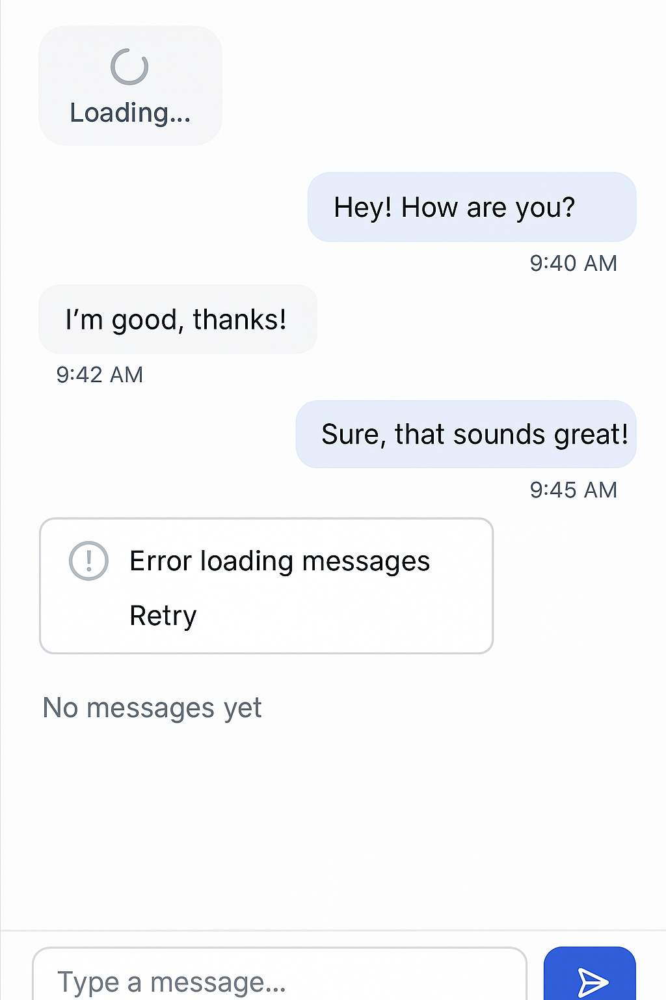

# Day 12 : Messaging Screen

## 🎯 Goal

Build the **Messaging Screen** module for the Prok Professional Networking app. This module focuses on the detailed chat experience—displaying the actual conversation between two users, showing message history, and sending/receiving messages in real time.

## 📚 Learning Outcomes

- Display message threads and chat history for a selected conversation.
- Implement a chat UI for sending and receiving messages.
- (Optional) Add real-time updates for new messages.
- Handle loading, error, and empty states in the chat UI.
- Learn best practices for chat UX and real-time data handling.

## 📸 Preview



## 🛠️ Tasks

1. **Setup the Project**

   - Clone the repository and navigate to the `12-messaging-screen` folder.
   - Install frontend dependencies in the `frontend` directory:
     ```bash
     cd frontend
     npm install
     ```
   - Install backend dependencies in the `backend` directory:
     ```bash
     cd backend
     pip install -r requirements.txt
     ```

2. **Frontend Implementation**

   - Build a chat UI to display message threads and chat history for a selected conversation.
   - Add input for sending new messages.
   - Show loading, error, and empty states in the chat window.
   - (Optional) Add real-time updates for new messages.

3. **Backend Integration**

   - Connect to backend endpoints for fetching and sending messages.
   - Ensure proper authentication and error handling.

4. **Testing**
   - Test displaying chat history, sending messages, and receiving new messages.
   - Test UI with no messages, many messages, and error scenarios.

## ✅ Deliverable

A working messaging screen module with a clean chat UI and functional backend, pushed to GitHub in the `/final` folder.

---

## 🚀 Getting Started

### Prerequisites

- Node.js and npm
- Python 3.x and pip

### Setup Steps

1. **Clone the repository**
   ```bash
   git clone <repo-url>
   cd 12-messaging-screen
   ```
2. **Install dependencies**
   - Frontend:
     ```bash
     cd frontend
     npm install
     ```
   - Backend:
     ```bash
     cd backend
     pip install -r requirements.txt
     ```
3. **Run the applications**
   - Start the backend server:
     ```bash
     cd backend
     flask run
     ```
   - Start the frontend development server:
     ```bash
     cd frontend
     npm start
     ```
4. **Access the app**
   - Open your browser and go to `http://localhost:3000/messaging/:conversationId` to view a chat screen.
   - Backend API runs on `http://localhost:5000` by default.

---

## 🗂️ Folder Structure

```
12-messaging-screen/
  README.md
  final/         # Your completed solution goes here
  backend/       # Flask backend code
    app.py
    requirements.txt
    models/
      message.py
      user.py
  frontend/      # React frontend code
    package.json
    src/
      index.jsx
```

---

If you have any questions or need help, feel free to open an issue or reach out to the instructor.

---
