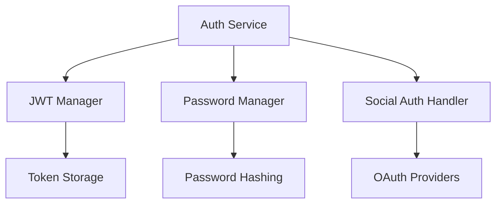
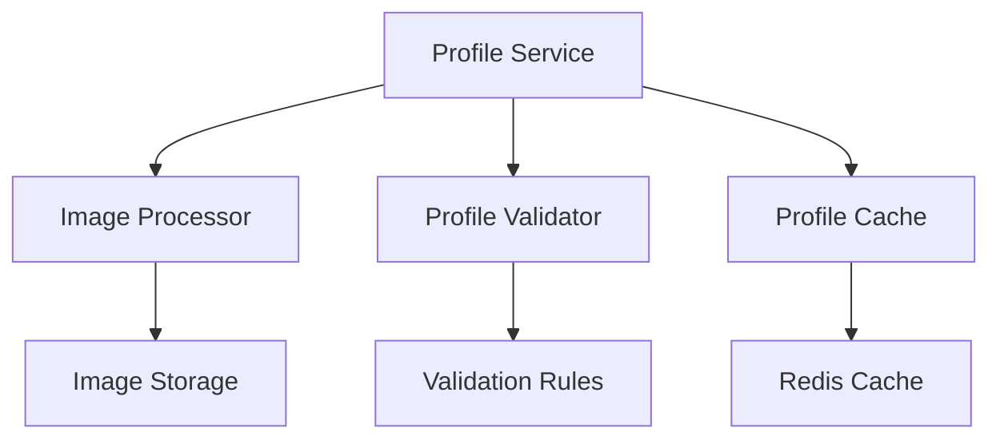
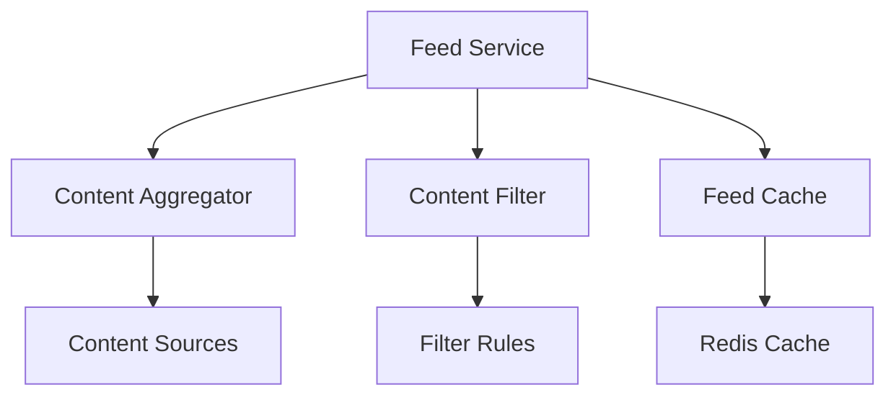
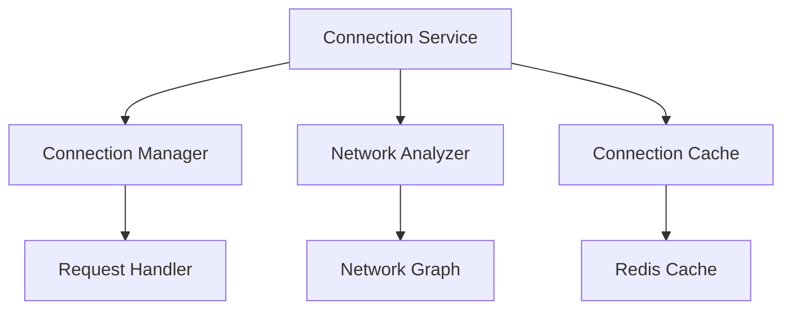
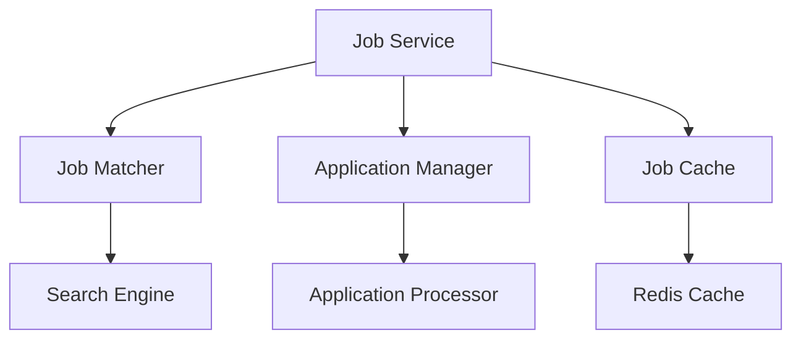
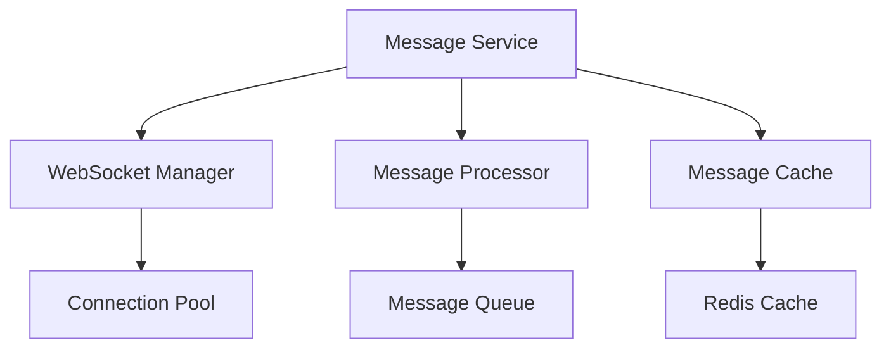
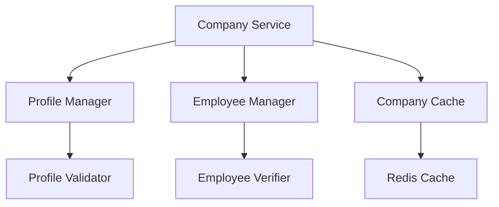
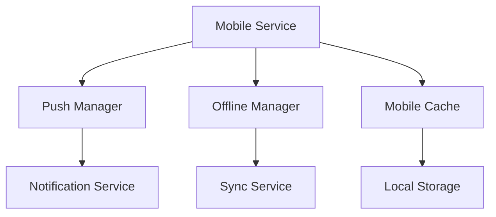

# Features Technical Specification

## Table of Contents

1. [User Authentication & Profile Management](#1-user-authentication--profile-management)
2. [Feed & Content Management](#2-feed--content-management)
3. [Networking & Connections](#3-networking--connections)
4. [Job Board & Applications](#4-job-board--applications)
5. [Messaging System](#5-messaging-system)
6. [Company Pages](#6-company-pages)
7. [Mobile Experience](#7-mobile-experience)

## 1. User Authentication & Profile Management

### 1.1 Authentication System (AUTH-001)

#### Component Design



#### Data Models

```typescript
interface User {
  id: string;
  email: string;
  passwordHash: string;
  salt: string;
  authProvider: "local" | "google" | "linkedin";
  authProviderId?: string;
  isVerified: boolean;
  lastLogin: Date;
  createdAt: Date;
  updatedAt: Date;
}

interface AuthToken {
  userId: string;
  token: string;
  type: "access" | "refresh";
  expiresAt: Date;
  createdAt: Date;
}
```

#### API Endpoints

```typescript
// Authentication
POST / api / auth / register;
POST / api / auth / login;
POST / api / auth / logout;
POST / api / auth / refresh - token;
POST / api / auth / verify - email;
POST / api / auth / reset - password;
POST / api / auth / change - password;

// Social Auth
GET / api / auth / google;
GET / api / auth / linkedin;
POST / api / auth / social - callback;
```

#### Algorithms

1. **Password Hashing**

   ```python
   def hash_password(password: str) -> tuple[str, str]:
       salt = generate_salt()
       hash = bcrypt.hash(password + salt)
       return hash, salt
   ```

2. **JWT Token Generation**

   ```python
   def generate_tokens(user_id: str) -> dict:
       access_token = jwt.encode({
           'user_id': user_id,
           'exp': datetime.utcnow() + timedelta(minutes=15)
       }, SECRET_KEY)

       refresh_token = jwt.encode({
           'user_id': user_id,
           'exp': datetime.utcnow() + timedelta(days=7)
       }, SECRET_KEY)

       return {
           'access_token': access_token,
           'refresh_token': refresh_token
       }
   ```

#### Database Interactions

```sql
-- User Table
CREATE TABLE users (
    id UUID PRIMARY KEY,
    email VARCHAR(255) UNIQUE NOT NULL,
    password_hash VARCHAR(255),
    salt VARCHAR(255),
    auth_provider VARCHAR(20) NOT NULL,
    auth_provider_id VARCHAR(255),
    is_verified BOOLEAN DEFAULT FALSE,
    last_login TIMESTAMP,
    created_at TIMESTAMP DEFAULT CURRENT_TIMESTAMP,
    updated_at TIMESTAMP DEFAULT CURRENT_TIMESTAMP
);

-- Auth Tokens Table
CREATE TABLE auth_tokens (
    id UUID PRIMARY KEY,
    user_id UUID REFERENCES users(id),
    token VARCHAR(255) NOT NULL,
    type VARCHAR(20) NOT NULL,
    expires_at TIMESTAMP NOT NULL,
    created_at TIMESTAMP DEFAULT CURRENT_TIMESTAMP
);
```

### 1.2 Profile Management (PROFILE-001)

#### Component Design



#### Data Models

```typescript
interface Profile {
  id: string;
  userId: string;
  firstName: string;
  lastName: string;
  headline: string;
  bio: string;
  location: string;
  profilePicture: string;
  coverPhoto: string;
  skills: Skill[];
  experience: Experience[];
  education: Education[];
  visibility: "public" | "connections" | "private";
  completionPercentage: number;
  createdAt: Date;
  updatedAt: Date;
}

interface Skill {
  id: string;
  name: string;
  endorsements: number;
  endorsedBy: string[];
}

interface Experience {
  id: string;
  title: string;
  company: string;
  location: string;
  startDate: Date;
  endDate?: Date;
  current: boolean;
  description: string;
}

interface Education {
  id: string;
  school: string;
  degree: string;
  field: string;
  startDate: Date;
  endDate?: Date;
  current: boolean;
  description: string;
}
```

#### API Endpoints

```typescript
// Profile Management
GET /api/profiles/:id
PUT /api/profiles/:id
PATCH /api/profiles/:id/visibility
POST /api/profiles/:id/picture
POST /api/profiles/:id/cover
DELETE /api/profiles/:id/picture
DELETE /api/profiles/:id/cover

// Skills
POST /api/profiles/:id/skills
PUT /api/profiles/:id/skills/:skillId
DELETE /api/profiles/:id/skills/:skillId
POST /api/profiles/:id/skills/:skillId/endorse

// Experience
POST /api/profiles/:id/experience
PUT /api/profiles/:id/experience/:expId
DELETE /api/profiles/:id/experience/:expId

// Education
POST /api/profiles/:id/education
PUT /api/profiles/:id/education/:eduId
DELETE /api/profiles/:id/education/:eduId
```

#### Algorithms

1. **Profile Completion Calculator**

   ```python
   def calculate_completion(profile: Profile) -> float:
       required_fields = ['firstName', 'lastName', 'headline', 'location']
       optional_fields = ['bio', 'profilePicture', 'skills', 'experience', 'education']

       completion = 0
       # Required fields (60% of total)
       for field in required_fields:
           if getattr(profile, field):
               completion += 15

       # Optional fields (40% of total)
       for field in optional_fields:
           if getattr(profile, field):
               completion += 10

       return min(completion, 100)
   ```

2. **Image Processing**

   ```python
   def process_profile_image(image: bytes) -> dict:
       # Resize image
       resized = resize_image(image, (400, 400))

       # Optimize image
       optimized = optimize_image(resized)

       # Generate thumbnail
       thumbnail = create_thumbnail(optimized, (100, 100))

       return {
           'main': optimized,
           'thumbnail': thumbnail
       }
   ```

#### Database Interactions

```sql
-- Profiles Table
CREATE TABLE profiles (
    id UUID PRIMARY KEY,
    user_id UUID REFERENCES users(id),
    first_name VARCHAR(100) NOT NULL,
    last_name VARCHAR(100) NOT NULL,
    headline VARCHAR(255),
    bio TEXT,
    location VARCHAR(255),
    profile_picture VARCHAR(255),
    cover_photo VARCHAR(255),
    visibility VARCHAR(20) DEFAULT 'public',
    completion_percentage INTEGER DEFAULT 0,
    created_at TIMESTAMP DEFAULT CURRENT_TIMESTAMP,
    updated_at TIMESTAMP DEFAULT CURRENT_TIMESTAMP
);

-- Skills Table
CREATE TABLE skills (
    id UUID PRIMARY KEY,
    profile_id UUID REFERENCES profiles(id),
    name VARCHAR(100) NOT NULL,
    endorsements INTEGER DEFAULT 0,
    created_at TIMESTAMP DEFAULT CURRENT_TIMESTAMP
);

-- Experience Table
CREATE TABLE experience (
    id UUID PRIMARY KEY,
    profile_id UUID REFERENCES profiles(id),
    title VARCHAR(255) NOT NULL,
    company VARCHAR(255) NOT NULL,
    location VARCHAR(255),
    start_date DATE NOT NULL,
    end_date DATE,
    current BOOLEAN DEFAULT FALSE,
    description TEXT,
    created_at TIMESTAMP DEFAULT CURRENT_TIMESTAMP,
    updated_at TIMESTAMP DEFAULT CURRENT_TIMESTAMP
);

-- Education Table
CREATE TABLE education (
    id UUID PRIMARY KEY,
    profile_id UUID REFERENCES profiles(id),
    school VARCHAR(255) NOT NULL,
    degree VARCHAR(255) NOT NULL,
    field VARCHAR(255) NOT NULL,
    start_date DATE NOT NULL,
    end_date DATE,
    current BOOLEAN DEFAULT FALSE,
    description TEXT,
    created_at TIMESTAMP DEFAULT CURRENT_TIMESTAMP,
    updated_at TIMESTAMP DEFAULT CURRENT_TIMESTAMP
);
```

## 2. Feed & Content Management

### 2.1 Content Feed (FEED-001)

#### Component Design



#### Data Models

```typescript
interface Post {
  id: string;
  authorId: string;
  content: string;
  mediaUrls: string[];
  visibility: "public" | "connections" | "private";
  engagement: {
    likes: number;
    comments: number;
    shares: number;
  };
  createdAt: Date;
  updatedAt: Date;
}

interface Comment {
  id: string;
  postId: string;
  authorId: string;
  content: string;
  parentId?: string;
  createdAt: Date;
  updatedAt: Date;
}

interface FeedItem {
  id: string;
  type: "post" | "article" | "job";
  content: Post | Article | Job;
  relevance: number;
  createdAt: Date;
}
```

#### API Endpoints

```typescript
// Feed
GET /api/feed
GET /api/feed/trending
GET /api/feed/recommended
POST /api/feed/filter

// Posts
POST /api/posts
GET /api/posts/:id
PUT /api/posts/:id
DELETE /api/posts/:id
POST /api/posts/:id/like
POST /api/posts/:id/comment
POST /api/posts/:id/share
```

#### Algorithms

1. **Feed Ranking Algorithm**

   ```python
   def rank_feed_items(user_id: str, items: List[FeedItem]) -> List[FeedItem]:
       for item in items:
           # Calculate relevance score
           relevance = 0

           # Content type weight
           type_weights = {
               'post': 1.0,
               'article': 1.2,
               'job': 0.8
           }
           relevance += type_weights[item.type]

           # Engagement weight
           engagement_score = (
               item.content.engagement.likes * 0.4 +
               item.content.engagement.comments * 0.4 +
               item.content.engagement.shares * 0.2
           )
           relevance += engagement_score

           # Time decay
           time_diff = datetime.now() - item.createdAt
           time_decay = 1 / (1 + time_diff.days)
           relevance *= time_decay

           item.relevance = relevance

       return sorted(items, key=lambda x: x.relevance, reverse=True)
   ```

2. **Content Filtering**

   ```python
   def filter_content(content: str) -> bool:
       # Check for inappropriate content
       if contains_inappropriate_content(content):
           return False

       # Check for spam
       if is_spam(content):
           return False

       # Check for duplicate content
       if is_duplicate(content):
           return False

       return True
   ```

#### Database Interactions

```sql
-- Posts Table
CREATE TABLE posts (
    id UUID PRIMARY KEY,
    author_id UUID REFERENCES users(id),
    content TEXT NOT NULL,
    media_urls TEXT[],
    visibility VARCHAR(20) DEFAULT 'public',
    likes_count INTEGER DEFAULT 0,
    comments_count INTEGER DEFAULT 0,
    shares_count INTEGER DEFAULT 0,
    created_at TIMESTAMP DEFAULT CURRENT_TIMESTAMP,
    updated_at TIMESTAMP DEFAULT CURRENT_TIMESTAMP
);

-- Comments Table
CREATE TABLE comments (
    id UUID PRIMARY KEY,
    post_id UUID REFERENCES posts(id),
    author_id UUID REFERENCES users(id),
    content TEXT NOT NULL,
    parent_id UUID REFERENCES comments(id),
    created_at TIMESTAMP DEFAULT CURRENT_TIMESTAMP,
    updated_at TIMESTAMP DEFAULT CURRENT_TIMESTAMP
);

-- Feed Items Table
CREATE TABLE feed_items (
    id UUID PRIMARY KEY,
    user_id UUID REFERENCES users(id),
    item_type VARCHAR(20) NOT NULL,
    item_id UUID NOT NULL,
    relevance FLOAT DEFAULT 0,
    created_at TIMESTAMP DEFAULT CURRENT_TIMESTAMP
);
```

## 3. Networking & Connections

### 3.1 Connection Management (NET-001)

#### Component Design



#### Data Models

```typescript
interface Connection {
  id: string;
  senderId: string;
  receiverId: string;
  status: "pending" | "accepted" | "rejected";
  message?: string;
  createdAt: Date;
  updatedAt: Date;
}

interface NetworkNode {
  userId: string;
  connections: string[];
  mutualConnections: number;
  relevance: number;
}

interface ConnectionRequest {
  id: string;
  senderId: string;
  receiverId: string;
  message: string;
  status: "pending" | "accepted" | "rejected";
  createdAt: Date;
  updatedAt: Date;
}
```

#### API Endpoints

```typescript
// Connections
GET /api/connections
POST /api/connections
PUT /api/connections/:id
DELETE /api/connections/:id

// Connection Requests
GET /api/connections/requests
POST /api/connections/requests
PUT /api/connections/requests/:id
DELETE /api/connections/requests/:id

// Network
GET /api/network/suggestions
GET /api/network/mutual/:userId
GET /api/network/degrees/:userId
```

#### Algorithms

1. **Connection Suggestion Algorithm**

   ```python
   def suggest_connections(user_id: str) -> List[NetworkNode]:
       # Get user's current connections
       user_connections = get_user_connections(user_id)

       # Get potential connections (2nd degree)
       potential_connections = get_potential_connections(user_connections)

       # Calculate relevance for each potential connection
       for node in potential_connections:
           # Mutual connections weight
           mutual_weight = len(get_mutual_connections(user_id, node.userId)) * 0.4

           # Industry similarity weight
           industry_weight = calculate_industry_similarity(user_id, node.userId) * 0.3

           # Location proximity weight
           location_weight = calculate_location_proximity(user_id, node.userId) * 0.3

           node.relevance = mutual_weight + industry_weight + location_weight

       return sorted(potential_connections, key=lambda x: x.relevance, reverse=True)
   ```

2. **Network Analysis**

   ```python
   def analyze_network(user_id: str) -> dict:
       # Get user's network
       network = get_user_network(user_id)

       # Calculate network metrics
       metrics = {
           'total_connections': len(network.connections),
           'mutual_connections': calculate_mutual_connections(network),
           'network_density': calculate_network_density(network),
           'industry_distribution': calculate_industry_distribution(network),
           'location_distribution': calculate_location_distribution(network)
       }

       return metrics
   ```

#### Database Interactions

```sql
-- Connections Table
CREATE TABLE connections (
    id UUID PRIMARY KEY,
    sender_id UUID REFERENCES users(id),
    receiver_id UUID REFERENCES users(id),
    status VARCHAR(20) DEFAULT 'pending',
    message TEXT,
    created_at TIMESTAMP DEFAULT CURRENT_TIMESTAMP,
    updated_at TIMESTAMP DEFAULT CURRENT_TIMESTAMP,
    UNIQUE(sender_id, receiver_id)
);

-- Connection Requests Table
CREATE TABLE connection_requests (
    id UUID PRIMARY KEY,
    sender_id UUID REFERENCES users(id),
    receiver_id UUID REFERENCES users(id),
    message TEXT,
    status VARCHAR(20) DEFAULT 'pending',
    created_at TIMESTAMP DEFAULT CURRENT_TIMESTAMP,
    updated_at TIMESTAMP DEFAULT CURRENT_TIMESTAMP
);

-- Network Cache Table
CREATE TABLE network_cache (
    user_id UUID REFERENCES users(id),
    cache_key VARCHAR(255),
    cache_value JSONB,
    expires_at TIMESTAMP,
    created_at TIMESTAMP DEFAULT CURRENT_TIMESTAMP,
    PRIMARY KEY (user_id, cache_key)
);
```

## 4. Job Board & Applications

### 4.1 Job Search and Applications (JOB-001)

#### Component Design



#### Data Models

```typescript
interface Job {
  id: string;
  companyId: string;
  title: string;
  description: string;
  requirements: string[];
  location: string;
  type: "full-time" | "part-time" | "contract" | "internship";
  salary: {
    min: number;
    max: number;
    currency: string;
  };
  status: "active" | "closed";
  applications: number;
  createdAt: Date;
  updatedAt: Date;
}

interface Application {
  id: string;
  jobId: string;
  userId: string;
  status: "applied" | "reviewing" | "interviewing" | "offered" | "rejected";
  resume: string;
  coverLetter?: string;
  createdAt: Date;
  updatedAt: Date;
}

interface JobSearch {
  query: string;
  filters: {
    location?: string;
    type?: string[];
    salary?: {
      min: number;
      max: number;
    };
    experience?: string[];
    postedWithin?: number;
  };
  sort: "relevance" | "date" | "salary";
  page: number;
  limit: number;
}
```

#### API Endpoints

```typescript
// Jobs
GET /api/jobs
GET /api/jobs/:id
POST /api/jobs
PUT /api/jobs/:id
DELETE /api/jobs/:id

// Applications
GET /api/jobs/:id/applications
POST /api/jobs/:id/applications
PUT /api/applications/:id
GET /api/applications
GET /api/applications/:id

// Job Search
POST /api/jobs/search
GET /api/jobs/suggestions
GET /api/jobs/saved
POST /api/jobs/:id/save
DELETE /api/jobs/:id/save
```

#### Algorithms

1. **Job Matching Algorithm**

   ```python
   def match_jobs(user_id: str, jobs: List[Job]) -> List[Job]:
       user_profile = get_user_profile(user_id)

       for job in jobs:
           # Calculate match score
           match_score = 0

           # Skills match (40%)
           skills_match = calculate_skills_match(user_profile.skills, job.requirements)
           match_score += skills_match * 0.4

           # Experience match (30%)
           exp_match = calculate_experience_match(user_profile.experience, job.requirements)
           match_score += exp_match * 0.3

           # Location match (20%)
           location_match = calculate_location_match(user_profile.location, job.location)
           match_score += location_match * 0.2

           # Company match (10%)
           company_match = calculate_company_match(user_profile, job.companyId)
           match_score += company_match * 0.1

           job.match_score = match_score

       return sorted(jobs, key=lambda x: x.match_score, reverse=True)
   ```

2. **Application Processing**

   ```python
   def process_application(application: Application) -> dict:
       # Validate application
       if not validate_application(application):
           raise ValidationError("Invalid application")

       # Check for duplicate applications
       if is_duplicate_application(application):
           raise DuplicateError("Duplicate application")

       # Process resume
       resume_data = parse_resume(application.resume)

       # Store application
       application_id = store_application(application, resume_data)

       # Notify relevant parties
       notify_application_submitted(application)

       return {
           'application_id': application_id,
           'status': 'submitted',
           'next_steps': get_next_steps(application)
       }
   ```

#### Database Interactions

```sql
-- Jobs Table
CREATE TABLE jobs (
    id UUID PRIMARY KEY,
    company_id UUID REFERENCES companies(id),
    title VARCHAR(255) NOT NULL,
    description TEXT NOT NULL,
    requirements TEXT[] NOT NULL,
    location VARCHAR(255) NOT NULL,
    type VARCHAR(20) NOT NULL,
    salary_min INTEGER,
    salary_max INTEGER,
    salary_currency VARCHAR(3),
    status VARCHAR(20) DEFAULT 'active',
    applications_count INTEGER DEFAULT 0,
    created_at TIMESTAMP DEFAULT CURRENT_TIMESTAMP,
    updated_at TIMESTAMP DEFAULT CURRENT_TIMESTAMP
);

-- Applications Table
CREATE TABLE applications (
    id UUID PRIMARY KEY,
    job_id UUID REFERENCES jobs(id),
    user_id UUID REFERENCES users(id),
    status VARCHAR(20) DEFAULT 'applied',
    resume_url VARCHAR(255) NOT NULL,
    cover_letter TEXT,
    created_at TIMESTAMP DEFAULT CURRENT_TIMESTAMP,
    updated_at TIMESTAMP DEFAULT CURRENT_TIMESTAMP
);

-- Saved Jobs Table
CREATE TABLE saved_jobs (
    user_id UUID REFERENCES users(id),
    job_id UUID REFERENCES jobs(id),
    created_at TIMESTAMP DEFAULT CURRENT_TIMESTAMP,
    PRIMARY KEY (user_id, job_id)
);
```

## 5. Messaging System

### 5.1 Real-time Messaging (MSG-001)

#### Component Design



#### Data Models

```typescript
interface Message {
  id: string;
  conversationId: string;
  senderId: string;
  content: string;
  type: "text" | "file" | "image";
  status: "sent" | "delivered" | "read";
  metadata?: {
    fileUrl?: string;
    fileName?: string;
    fileSize?: number;
    fileType?: string;
  };
  createdAt: Date;
  updatedAt: Date;
}

interface Conversation {
  id: string;
  participants: string[];
  lastMessage?: Message;
  unreadCount: number;
  createdAt: Date;
  updatedAt: Date;
}

interface MessageEvent {
  type: "message" | "typing" | "read" | "delivered";
  conversationId: string;
  senderId: string;
  data: any;
  timestamp: Date;
}
```

#### API Endpoints

```typescript
// Conversations
GET /api/conversations
POST /api/conversations
GET /api/conversations/:id
PUT /api/conversations/:id
DELETE /api/conversations/:id

// Messages
GET /api/conversations/:id/messages
POST /api/conversations/:id/messages
PUT /api/messages/:id
DELETE /api/messages/:id

// WebSocket
WS /ws/messages
WS /ws/typing
WS /ws/status
```

#### Algorithms

1. **Message Delivery Algorithm**

   ```python
   async def deliver_message(message: Message):
       # Store message
       await store_message(message)

       # Get conversation participants
       participants = await get_conversation_participants(message.conversationId)

       # Send to online participants
       for participant in participants:
           if is_user_online(participant):
               await send_websocket_message(participant, {
                   'type': 'message',
                   'data': message
               })
           else:
               # Queue for offline delivery
               await queue_offline_message(participant, message)

       # Update conversation
       await update_conversation(message.conversationId, {
           'lastMessage': message,
           'updatedAt': datetime.now()
       })
   ```

2. **Message Search**

   ```python
   def search_messages(user_id: str, query: str) -> List[Message]:
       # Get user's conversations
       conversations = get_user_conversations(user_id)

       # Search in each conversation
       results = []
       for conversation in conversations:
           messages = search_conversation_messages(
               conversation.id,
               query,
               user_id
           )
           results.extend(messages)

       # Sort by relevance and date
       return sort_search_results(results)
   ```

#### Database Interactions

```sql
-- Conversations Table
CREATE TABLE conversations (
    id UUID PRIMARY KEY,
    participants UUID[] NOT NULL,
    last_message_id UUID,
    unread_count INTEGER DEFAULT 0,
    created_at TIMESTAMP DEFAULT CURRENT_TIMESTAMP,
    updated_at TIMESTAMP DEFAULT CURRENT_TIMESTAMP
);

-- Messages Table
CREATE TABLE messages (
    id UUID PRIMARY KEY,
    conversation_id UUID REFERENCES conversations(id),
    sender_id UUID REFERENCES users(id),
    content TEXT NOT NULL,
    type VARCHAR(20) DEFAULT 'text',
    status VARCHAR(20) DEFAULT 'sent',
    metadata JSONB,
    created_at TIMESTAMP DEFAULT CURRENT_TIMESTAMP,
    updated_at TIMESTAMP DEFAULT CURRENT_TIMESTAMP
);

-- Message Events Table
CREATE TABLE message_events (
    id UUID PRIMARY KEY,
    conversation_id UUID REFERENCES conversations(id),
    user_id UUID REFERENCES users(id),
    event_type VARCHAR(20) NOT NULL,
    event_data JSONB,
    created_at TIMESTAMP DEFAULT CURRENT_TIMESTAMP
);
```

## 6. Company Pages

### 6.1 Company Profile Management (COMP-001)

#### Component Design



#### Data Models

```typescript
interface Company {
  id: string;
  name: string;
  description: string;
  industry: string;
  size: string;
  founded: number;
  headquarters: string;
  website: string;
  logo: string;
  coverPhoto: string;
  verified: boolean;
  employees: number;
  followers: number;
  createdAt: Date;
  updatedAt: Date;
}

interface CompanyEmployee {
  id: string;
  companyId: string;
  userId: string;
  role: string;
  department: string;
  startDate: Date;
  endDate?: Date;
  current: boolean;
  verified: boolean;
  createdAt: Date;
  updatedAt: Date;
}

interface CompanyUpdate {
  id: string;
  companyId: string;
  content: string;
  mediaUrls: string[];
  engagement: {
    likes: number;
    comments: number;
    shares: number;
  };
  createdAt: Date;
  updatedAt: Date;
}
```

#### API Endpoints

```typescript
// Company Profiles
GET /api/companies
POST /api/companies
GET /api/companies/:id
PUT /api/companies/:id
DELETE /api/companies/:id

// Company Employees
GET /api/companies/:id/employees
POST /api/companies/:id/employees
PUT /api/companies/:id/employees/:employeeId
DELETE /api/companies/:id/employees/:employeeId

// Company Updates
GET /api/companies/:id/updates
POST /api/companies/:id/updates
PUT /api/companies/:id/updates/:updateId
DELETE /api/companies/:id/updates/:updateId
```

#### Algorithms

1. **Employee Verification**

   ```python
   def verify_employee(employee: CompanyEmployee) -> bool:
       # Check email domain
       if not verify_email_domain(employee.userId, employee.companyId):
           return False

       # Check employment history
       if not verify_employment_history(employee):
           return False

       # Check company records
       if not verify_company_records(employee):
           return False

       return True
   ```

2. **Company Analytics**

   ```python
   def calculate_company_metrics(company_id: str) -> dict:
       # Get company data
       company = get_company(company_id)

       # Calculate metrics
       metrics = {
           'employee_growth': calculate_employee_growth(company),
           'engagement_rate': calculate_engagement_rate(company),
           'follower_growth': calculate_follower_growth(company),
           'content_performance': analyze_content_performance(company),
           'industry_rank': calculate_industry_rank(company)
       }

       return metrics
   ```

#### Database Interactions

```sql
-- Companies Table
CREATE TABLE companies (
    id UUID PRIMARY KEY,
    name VARCHAR(255) NOT NULL,
    description TEXT,
    industry VARCHAR(100),
    size VARCHAR(50),
    founded INTEGER,
    headquarters VARCHAR(255),
    website VARCHAR(255),
    logo_url VARCHAR(255),
    cover_photo_url VARCHAR(255),
    verified BOOLEAN DEFAULT FALSE,
    employees_count INTEGER DEFAULT 0,
    followers_count INTEGER DEFAULT 0,
    created_at TIMESTAMP DEFAULT CURRENT_TIMESTAMP,
    updated_at TIMESTAMP DEFAULT CURRENT_TIMESTAMP
);

-- Company Employees Table
CREATE TABLE company_employees (
    id UUID PRIMARY KEY,
    company_id UUID REFERENCES companies(id),
    user_id UUID REFERENCES users(id),
    role VARCHAR(100) NOT NULL,
    department VARCHAR(100),
    start_date DATE NOT NULL,
    end_date DATE,
    current BOOLEAN DEFAULT TRUE,
    verified BOOLEAN DEFAULT FALSE,
    created_at TIMESTAMP DEFAULT CURRENT_TIMESTAMP,
    updated_at TIMESTAMP DEFAULT CURRENT_TIMESTAMP
);

-- Company Updates Table
CREATE TABLE company_updates (
    id UUID PRIMARY KEY,
    company_id UUID REFERENCES companies(id),
    content TEXT NOT NULL,
    media_urls TEXT[],
    likes_count INTEGER DEFAULT 0,
    comments_count INTEGER DEFAULT 0,
    shares_count INTEGER DEFAULT 0,
    created_at TIMESTAMP DEFAULT CURRENT_TIMESTAMP,
    updated_at TIMESTAMP DEFAULT CURRENT_TIMESTAMP
);
```

## 7. Mobile Experience

### 7.1 Mobile App Features (MOBILE-001)

#### Component Design



#### Data Models

```typescript
interface MobileDevice {
  id: string;
  userId: string;
  deviceToken: string;
  platform: "ios" | "android";
  version: string;
  lastActive: Date;
  createdAt: Date;
  updatedAt: Date;
}

interface PushNotification {
  id: string;
  userId: string;
  type: "message" | "connection" | "job" | "update";
  title: string;
  body: string;
  data: any;
  status: "pending" | "sent" | "delivered" | "failed";
  createdAt: Date;
  updatedAt: Date;
}

interface OfflineData {
  id: string;
  userId: string;
  type: "post" | "message" | "profile";
  data: any;
  syncStatus: "pending" | "synced" | "failed";
  createdAt: Date;
  updatedAt: Date;
}
```

#### API Endpoints

```typescript
// Mobile Devices
POST /api/mobile/devices
PUT /api/mobile/devices/:id
DELETE /api/mobile/devices/:id

// Push Notifications
GET /api/mobile/notifications
POST /api/mobile/notifications
PUT /api/mobile/notifications/:id

// Offline Data
GET /api/mobile/offline
POST /api/mobile/offline/sync
DELETE /api/mobile/offline/:id
```

#### Algorithms

1. **Push Notification Routing**

   ```python
   async def route_push_notification(notification: PushNotification):
       # Get user's devices
       devices = await get_user_devices(notification.userId)

       # Filter active devices
       active_devices = [d for d in devices if is_device_active(d)]

       # Send to each device
       for device in active_devices:
           try:
               if device.platform == 'ios':
                   await send_ios_push(device.deviceToken, notification)
               else:
                   await send_android_push(device.deviceToken, notification)

               await update_notification_status(notification.id, 'sent')
           except Exception as e:
               await update_notification_status(notification.id, 'failed')
               log_error(f"Push notification failed: {str(e)}")
   ```

2. **Offline Data Sync**

   ```python
   async def sync_offline_data(user_id: str):
       # Get pending offline data
       pending_data = await get_pending_offline_data(user_id)

       for data in pending_data:
           try:
               # Sync based on type
               if data.type == 'post':
                   await sync_post(data)
               elif data.type == 'message':
                   await sync_message(data)
               elif data.type == 'profile':
                   await sync_profile(data)

               await update_sync_status(data.id, 'synced')
           except Exception as e:
               await update_sync_status(data.id, 'failed')
               log_error(f"Sync failed: {str(e)}")
   ```

#### Database Interactions

```sql
-- Mobile Devices Table
CREATE TABLE mobile_devices (
    id UUID PRIMARY KEY,
    user_id UUID REFERENCES users(id),
    device_token VARCHAR(255) NOT NULL,
    platform VARCHAR(20) NOT NULL,
    version VARCHAR(50) NOT NULL,
    last_active TIMESTAMP,
    created_at TIMESTAMP DEFAULT CURRENT_TIMESTAMP,
    updated_at TIMESTAMP DEFAULT CURRENT_TIMESTAMP
);

-- Push Notifications Table
CREATE TABLE push_notifications (
    id UUID PRIMARY KEY,
    user_id UUID REFERENCES users(id),
    type VARCHAR(20) NOT NULL,
    title VARCHAR(255) NOT NULL,
    body TEXT NOT NULL,
    data JSONB,
    status VARCHAR(20) DEFAULT 'pending',
    created_at TIMESTAMP DEFAULT CURRENT_TIMESTAMP,
    updated_at TIMESTAMP DEFAULT CURRENT_TIMESTAMP
);

-- Offline Data Table
CREATE TABLE offline_data (
    id UUID PRIMARY KEY,
    user_id UUID REFERENCES users(id),
    type VARCHAR(20) NOT NULL,
    data JSONB NOT NULL,
    sync_status VARCHAR(20) DEFAULT 'pending',
    created_at TIMESTAMP DEFAULT CURRENT_TIMESTAMP,
    updated_at TIMESTAMP DEFAULT CURRENT_TIMESTAMP
);
```
