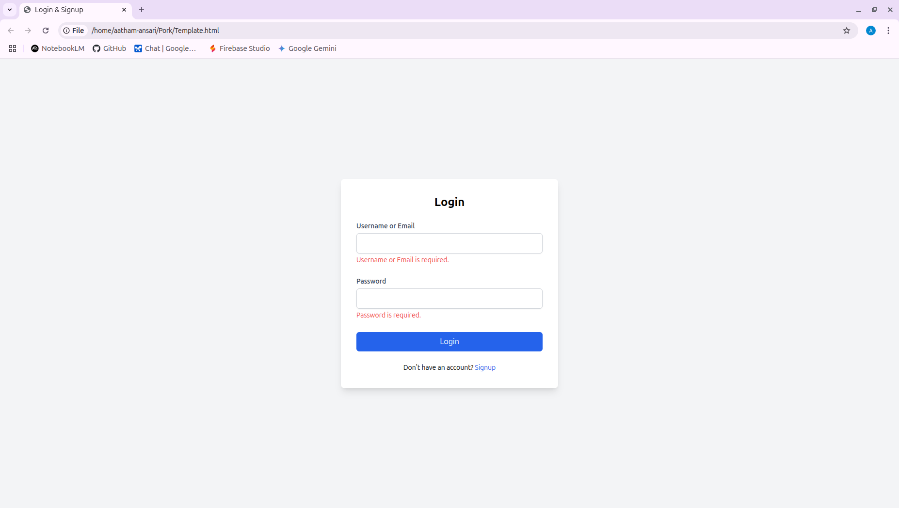
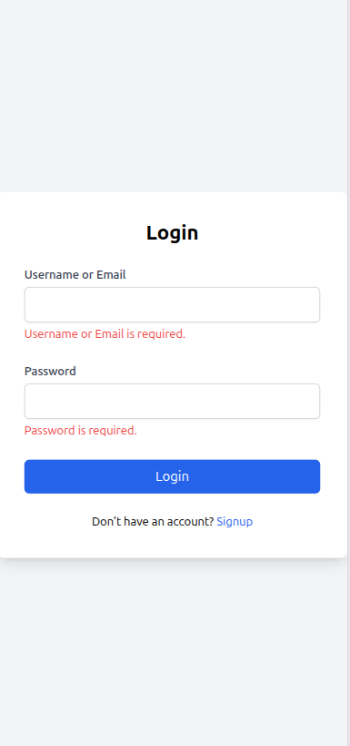
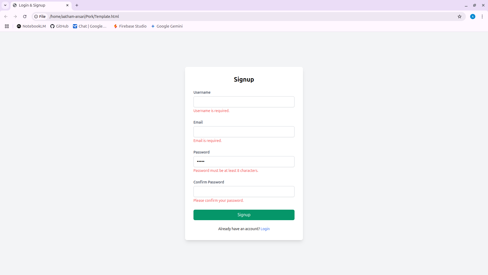
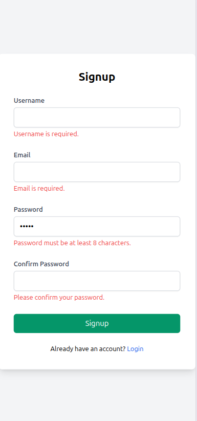
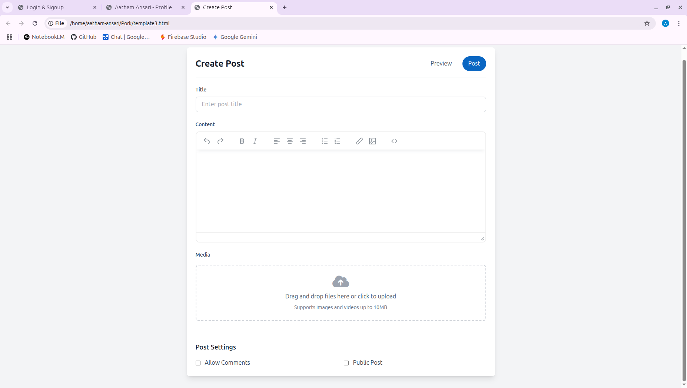
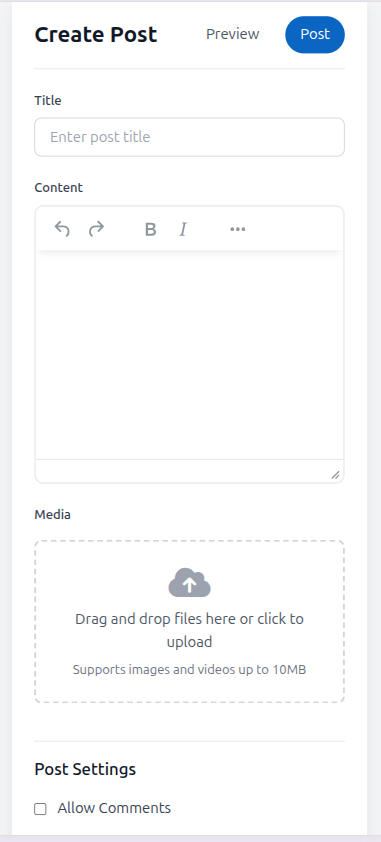
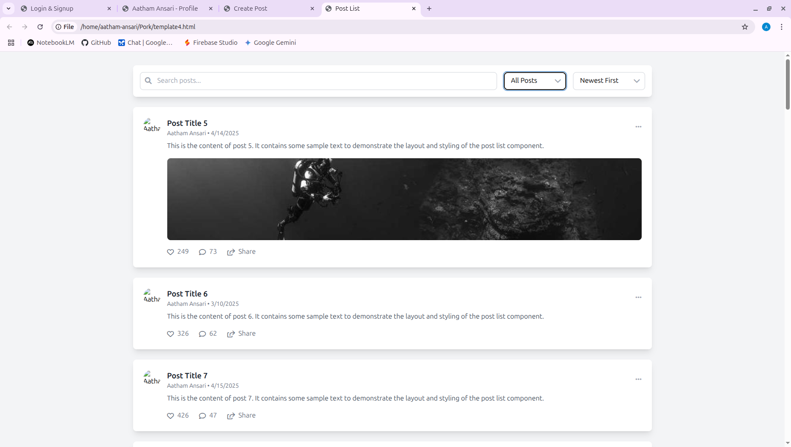
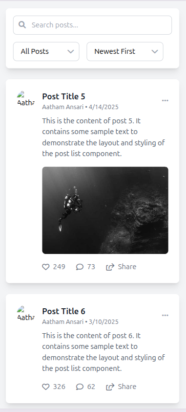
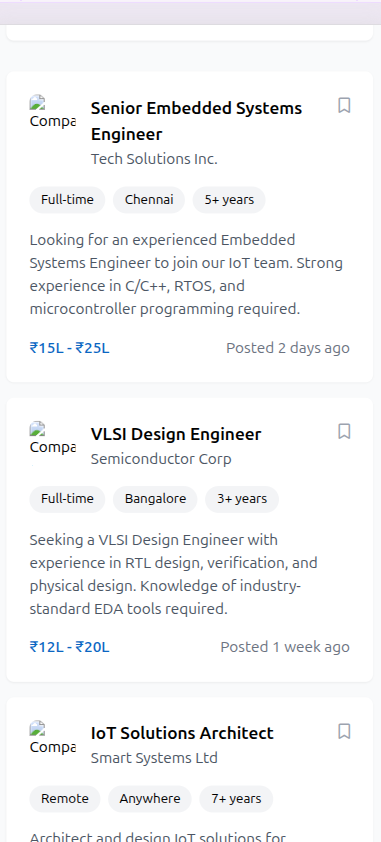

# Prok Professional Networking

## 📚 Table of Contents

- [What You'll Build](#-what-youll-build)
- [Learning Goals](#-learning-goals)
- [Tech Stack](#-tech-stack)
- [Project Structure](#-project-structure)
- [Getting Started](#-getting-started)
- [Daily Modules](#-daily-modules)
- [Success Metrics](#-success-metrics)
- [Learning Resources](#-learning-resources)


---

## 🎯 What You'll Build

A hands-on, tutorial-based professional networking platform that teaches you full-stack development! You'll learn to build a LinkedIn-inspired application step by step, focusing on practical implementation and core concepts.

### 📋 Module Overview

| Day | Module                                                                 | Preview                                                                                                                                                                                                                                                                         | Description                                              |
| --- | ---------------------------------------------------------------------- | ------------------------------------------------------------------------------------------------------------------------------------------------------------------------------------------------------------------------------------------------------------------------------- | -------------------------------------------------------- |
| 1   | [Login/Signup UI](tutorial/01-login-signup-ui/README.md)               |     | Create responsive login and signup forms with validation |
| 2   | [Authentication Backend](tutorial/02-authentication-backend/README.md) |                                                                                                                                                                                                                                                                                 | Implement secure user authentication with JWT            |
| 3   | [Profile View & Edit UI](tutorial/03-profile-view-edit-ui/README.md)   |                                                                                                                              | Build user profile pages with edit functionality         |
| 4   | [Profile Edit Backend](tutorial/04-profile-edit-backend/README.md)     |                                                                                                                                                                                                                                                                                 | Create profile management API endpoints                  |
| 5   | [Post Creation](tutorial/05-post-creation/README.md)                   |                                                                                                                                    | Implement post creation with media upload                |
| 6   | [Posts Listing](tutorial/06-posts-listing/README.md)                   |                                                                                                                                  | Display posts with infinite scroll                       |
| 7   | [First Deployment](tutorial/07-first-deployment/README.md)             |                                                                                                                                                                                                                                                                                 | Deploy initial version to production                     |
| 8   | [Basic Feed](tutorial/08-basic-feed/README.md)                         |                                                                                                                                                        | Create a dynamic social feed                             |
| 9   | [Feed Interactions](tutorial/09-feed-interactions/README.md)           |                                                                                                                                                                                                                                                                                 | Add like, comment, and share features                    |
| 10  | [Navigation System](tutorial/10-navigation-system/README.md)           |                                                                       | Implement responsive navigation                          |
| 11  | [Job Board](tutorial/11-job-board/README.md)                           |                                                                               | Create job posting and application system                |
| 12  | [Second Deployment](tutorial/12-second-deployment/README.md)           |                                                                                                                                                                                                                                                                                 | Deploy updated version with new features                 |
| 13  | [Messaging UI](tutorial/13-messaging-ui/README.md)                     |                                                                          | Build real-time messaging interface                      |
| 14  | [Messaging Backend](tutorial/14-messaging-backend/README.md)           |                                                                                                                                                                                                                                                                                 | Implement WebSocket-based messaging                      |
| 15  | [Final Integration](tutorial/15-final-integration/README.md)           |                                                                                                                                                                                                                                                                                 | Connect all modules and features                         |
| 16  | [Final Deployment](tutorial/16-final-deployment/README.md)             |                                                                                                                                                                                                                                                                                 | Deploy complete application with monitoring              |

---

## 🎓 Learning Goals

By completing this tutorial, you will be able to:

- Build responsive layouts that adapt to mobile, tablet, and desktop screens
- Implement device-specific navigation systems
- Create dynamic feeds and comprehensive profile pages
- Integrate job board and basic messaging features
- Understand full-stack development flow
- Use Git for version control
- Implement basic error handling
- Deploy a full-stack application

---

## 🛠 Tech Stack

- **Frontend:** React with Tailwind CSS
- **Backend:** Flask (Python)
- **Database:** MySQL
- **Version Control:** Git
- **Deployment:**
  - Frontend: Netlify or AWS
  - Backend: Python Anywhere

---

## 📁 Project Structure

```
Prok-Professional-Networking/
├── app/
│   ├── backend/         # Flask backend
│   └── frontend/        # React frontend
├── 01-login-signup-ui/  # Daily modules
├── ...
├── README.md            # This guide
```

---

## 🚀 Getting Started

### Prerequisites

- Node.js (v14 or higher)
- Python (v3.8 or higher)
- Git
- Code editor (VS Code recommended)
- Copilot
- For VS code, Git, Copilt, use this link -> "https://g.co/gemini/share/bb771d63f18b"

To check your installed versions:

```bash
# Check Node.js version
node --version

# Check Python version
python --version
```

1.**Fork the Template Repository (Online - on GitHub/GitLab)**

Go to the course template repository in your web browser:
"https://github.com/AathamAnsari03/Prok-Professional-Networking.git"

In the top-right corner of the repository page, click the "Fork" button.

> **What is Forking?** This creates a personal copy of the entire template repository under your own GitHub/GitLab account. This copy is completely independent of the original course template. You have full control over your fork.

If prompted, choose your personal account as the owner of the fork.

2.**Clone Your Fork to Your Local Machine**

Now that you have your own copy online, let's bring it to your computer:

- Go to your newly forked repository on GitHub/GitLab (it will be under your username)
- Click the green "Code" button
- Copy the URL (make sure it's the HTTPS URL, unless you've set up SSH keys)
- Open your terminal and navigate to your desired directory
- Run the following commands:

```bash
# Clone your fork
git clone <URL_of_YOUR_FORK>
# Example: git clone https://github.com/your-username/prok-professional-networking.git

# Open the project in VS code.
# Open the terminal in VS code.
# Change into the project directory
cd prok-professional-networking
```

> **What is Cloning?** This downloads a complete copy of your online fork to your local machine. This is your personal workspace for the course.

3. **Configure Your Git User Information (One-Time Setup)**

   This tells Git who you are when you make changes. If you've already done this for other projects on your computer, you can skip this step:

   ```bash
   git config --global user.name "Your Name"
   git config --global user.email "your.email@example.com"
   ```

   > **Note:** The `--global` flag sets your name and email for all Git projects on your computer.

---

## 📅 Daily Modules

### Milestone 1: Core Features (Days 1-6)

- Day 1: Project Setup & Login/Signup UI
- Day 2: Authentication Backend
- Day 3: User Profile View & Edit UI
- Day 4: Profile Edit Backend
- Day 5: Post Creation
- Day 6: Posts Listing
- Day 7: First Deployment

### Milestone 2: Advanced Features (Days 7-12)

- Day 8: Basic Feed
- Day 9: Feed Interactions
- Day 10: Navigation System
- Day 11: Job Board
- Day 12: Second Deployment

### Milestone 3: Final Features (Days 13-16)

- Day 13: Messaging UI
- Day 14: Messaging Backend
- Day 15: Final Integration
- Day 16: Final Deployment

---

## ✅ Success Metrics

You'll know you've successfully completed this tutorial when you can:

- Build responsive layouts that work across all devices
- Implement and explain different navigation systems
- Create and edit user profiles with data persistence
- Add and view posts in a dynamic feed
- Search and apply for jobs
- Send and view messages
- Deploy your full-stack application
- Use Git effectively for version control
- Handle basic errors gracefully

---

## 📚 Learning Resources

- [React Documentation](https://react.dev/)
- [Flask Documentation](https://flask.palletsprojects.com/)
- [Tailwind CSS Documentation](https://tailwindcss.com/)
- [Git Documentation](https://git-scm.com/doc)
- [Python Documentation](https://docs.python.org/3/)

---

> 💡 **Remember:** This is a learning-focused project. Take your time to understand each concept before moving to the next module.
