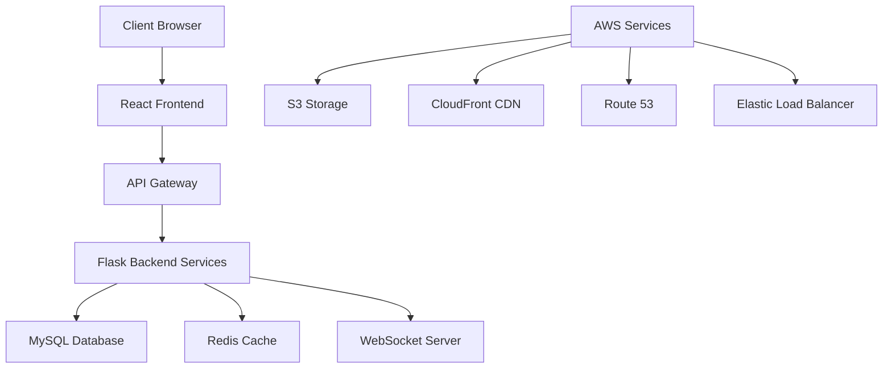
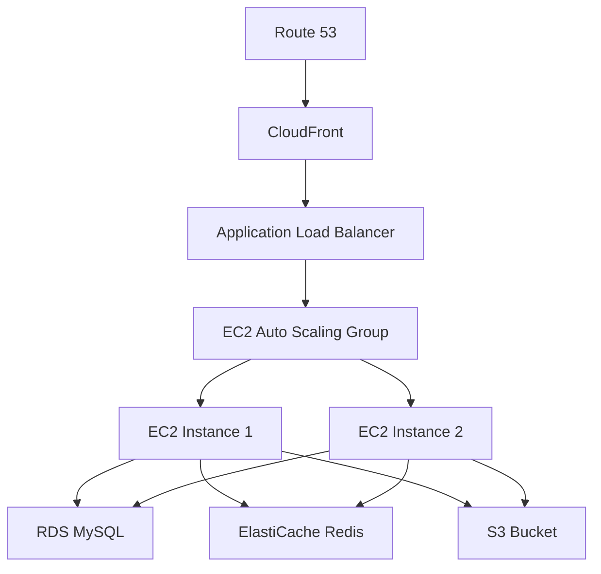
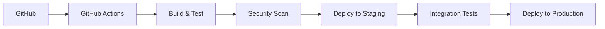

# Technical Specification: Prok Professional Networking Platform

## 1. Architecture Overview

### System Architecture


## 2. Technology Stack

### Frontend
- **Framework:** React 18.x
- **Styling:** Tailwind CSS
- **State Management:** Redux Toolkit
- **Routing:** React Router v6
- **Real-time Communication:** Socket.io-client
- **HTTP Client:** Axios
- **Form Handling:** React Hook Form
- **UI Components:** Headless UI
- **Build Tool:** Vite

### Backend
- **Framework:** Flask (Python)
- **API Style:** RESTful
- **Authentication:** JWT (JSON Web Tokens)
- **WebSocket:** Flask-SocketIO
- **ORM:** SQLAlchemy
- **Caching:** Redis
- **Task Queue:** Celery
- **Background Jobs:** Redis Queue

### Database
- **Primary Database:** MySQL 8.0
- **Caching Layer:** Redis
- **Search Engine:** Elasticsearch

### DevOps & Infrastructure
- **Cloud Provider:** AWS
- **Containerization:** Docker
- **Orchestration:** Kubernetes
- **CI/CD:** GitHub Actions
- **Monitoring:** AWS CloudWatch
- **Logging:** ELK Stack

## 3. API Design

### RESTful Endpoints

#### Authentication
```
POST /api/auth/register
POST /api/auth/login
POST /api/auth/logout
POST /api/auth/refresh-token
```

#### User Management
```
GET    /api/users
GET    /api/users/:id
PUT    /api/users/:id
DELETE /api/users/:id
```

#### Posts
```
GET    /api/posts
POST   /api/posts
GET    /api/posts/:id
PUT    /api/posts/:id
DELETE /api/posts/:id
```

#### Connections
```
GET    /api/connections
POST   /api/connections
PUT    /api/connections/:id
DELETE /api/connections/:id
```

#### Messaging
```
GET    /api/messages
POST   /api/messages
GET    /api/messages/:id
```

#### Jobs
```
GET    /api/jobs
POST   /api/jobs
GET    /api/jobs/:id
PUT    /api/jobs/:id
DELETE /api/jobs/:id
```

### WebSocket Events
```
connection
disconnect
message:send
message:receive
typing:start
typing:stop
```

## 4. Database Schema

### Users Table
```sql
CREATE TABLE users (
    id BIGINT PRIMARY KEY AUTO_INCREMENT,
    email VARCHAR(255) UNIQUE NOT NULL,
    password_hash VARCHAR(255) NOT NULL,
    first_name VARCHAR(100) NOT NULL,
    last_name VARCHAR(100) NOT NULL,
    profile_picture_url VARCHAR(255),
    headline VARCHAR(255),
    bio TEXT,
    location VARCHAR(255),
    created_at TIMESTAMP DEFAULT CURRENT_TIMESTAMP,
    updated_at TIMESTAMP DEFAULT CURRENT_TIMESTAMP ON UPDATE CURRENT_TIMESTAMP
);
```

### Posts Table
```sql
CREATE TABLE posts (
    id BIGINT PRIMARY KEY AUTO_INCREMENT,
    user_id BIGINT NOT NULL,
    content TEXT NOT NULL,
    media_url VARCHAR(255),
    created_at TIMESTAMP DEFAULT CURRENT_TIMESTAMP,
    updated_at TIMESTAMP DEFAULT CURRENT_TIMESTAMP ON UPDATE CURRENT_TIMESTAMP,
    FOREIGN KEY (user_id) REFERENCES users(id)
);
```

### Connections Table
```sql
CREATE TABLE connections (
    id BIGINT PRIMARY KEY AUTO_INCREMENT,
    sender_id BIGINT NOT NULL,
    receiver_id BIGINT NOT NULL,
    status ENUM('pending', 'accepted', 'rejected') DEFAULT 'pending',
    created_at TIMESTAMP DEFAULT CURRENT_TIMESTAMP,
    updated_at TIMESTAMP DEFAULT CURRENT_TIMESTAMP ON UPDATE CURRENT_TIMESTAMP,
    FOREIGN KEY (sender_id) REFERENCES users(id),
    FOREIGN KEY (receiver_id) REFERENCES users(id)
);
```

### Messages Table
```sql
CREATE TABLE messages (
    id BIGINT PRIMARY KEY AUTO_INCREMENT,
    sender_id BIGINT NOT NULL,
    receiver_id BIGINT NOT NULL,
    content TEXT NOT NULL,
    is_read BOOLEAN DEFAULT FALSE,
    created_at TIMESTAMP DEFAULT CURRENT_TIMESTAMP,
    FOREIGN KEY (sender_id) REFERENCES users(id),
    FOREIGN KEY (receiver_id) REFERENCES users(id)
);
```

### Jobs Table
```sql
CREATE TABLE jobs (
    id BIGINT PRIMARY KEY AUTO_INCREMENT,
    company_id BIGINT NOT NULL,
    title VARCHAR(255) NOT NULL,
    description TEXT NOT NULL,
    location VARCHAR(255),
    salary_range VARCHAR(100),
    job_type ENUM('full-time', 'part-time', 'contract', 'internship'),
    created_at TIMESTAMP DEFAULT CURRENT_TIMESTAMP,
    updated_at TIMESTAMP DEFAULT CURRENT_TIMESTAMP ON UPDATE CURRENT_TIMESTAMP,
    FOREIGN KEY (company_id) REFERENCES users(id)
);
```

## 5. Security Considerations

### Authentication & Authorization
- JWT-based authentication with refresh tokens
- Password hashing using bcrypt
- Rate limiting on authentication endpoints
- Session management with Redis
- Role-based access control (RBAC)

### Data Protection
- HTTPS/TLS encryption for all communications
- Input validation and sanitization
- SQL injection prevention using ORM
- XSS protection with Content Security Policy
- CSRF protection with tokens

### AWS Security
- VPC configuration with public and private subnets
- Security Groups for instance-level security
- IAM roles and policies for service access
- AWS WAF for web application firewall
- AWS Shield for DDoS protection

## 6. Scalability and Performance

### Horizontal Scaling
- Stateless application design
- Load balancing with AWS ELB
- Auto-scaling groups for EC2 instances
- Database read replicas
- Redis cluster for caching

### Performance Optimization
- CDN for static assets (AWS CloudFront)
- Database indexing strategy
- Query optimization
- Caching strategy (Redis)
- Image optimization and lazy loading

### Monitoring and Logging
- AWS CloudWatch for metrics
- ELK Stack for log aggregation
- Application performance monitoring
- Error tracking and alerting
- User behavior analytics

## 7. Deployment Architecture

### AWS Infrastructure


### CI/CD Pipeline


## 8. Development Workflow

### Version Control
- Git flow branching strategy
- Feature branches
- Pull request reviews
- Automated testing
- Continuous integration

### Environment Setup
- Development
- Staging
- Production
- Environment-specific configurations
- Secrets management

### Testing Strategy
- Unit tests (Jest, PyTest)
- Integration tests
- End-to-end tests (Cypress)
- Performance testing
- Security testing