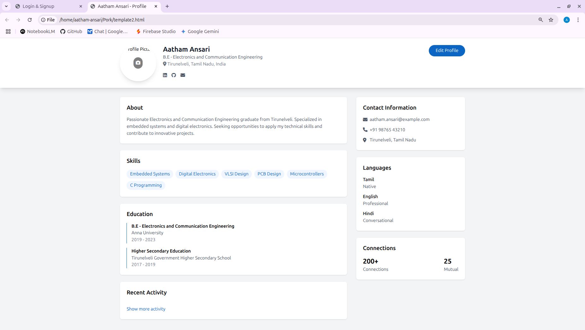
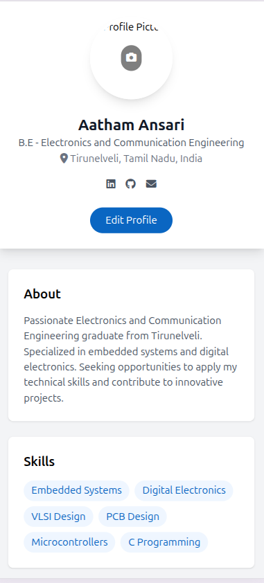
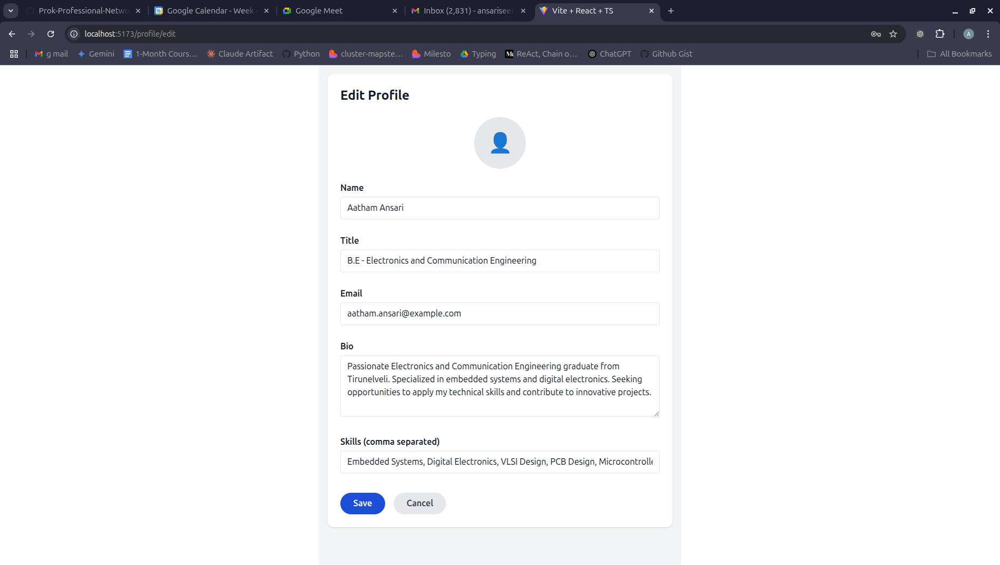
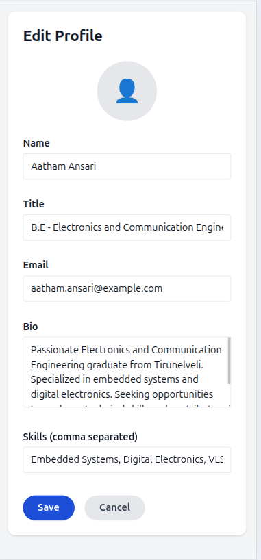

# Day 3: User Profile View & Edit UI

## 🎯 Goal

Develop User Profile View & Edit UI (frontend) with mock data integration.

## 📚 Learning Outcomes

- Create responsive profile view components.
- Implement profile edit functionality.
- Design user-friendly forms.
- Create image upload interface.
- Implement form validation.
- Create reusable UI components.

## 🚀 Getting Started

Ensure your Day 2 authentication is complete and working. You should have a good understanding of React forms and component structure. We'll use mock data for now, and integrate with the backend in Day 4.

## 🛠️ Tasks

1.  **Create and Switch to a New Branch**

    > **IMPORTANT:** Always create a new branch for each distinct piece of work.

    ```bash
    # First, ensure you are on your 'master' branch and it's up-to-date
    git checkout master
    git pull origin master  # Get any potential updates from your own fork's master

    # Now, create and switch to a new branch for this day's assignment/feature
    git checkout -b day-3-profile-ui
    ```

    > **What's happening?** You're creating an independent line of development for this day's tasks.

2.  **Set Up Development Environment**

    - **Frontend Dependencies:**
      ```bash
      cd app/frontend
      npm install react-hook-form yup @hookform/resolvers
      ```

3.  **Profile View Implementation**

    - **Create Profile Header Component:**
      - Design a responsive header component that includes a user avatar.
      - Display the user's name, title, and location.
      - Add a section for social media links.
      - Implement a responsive layout for both mobile and desktop views.
    - **Display User Information:**
      - Show the user's bio and skills.
      - Display work experience and education details.
      - Add a section for contact information.
      - Implement collapsible sections for improved mobile usability.
    - **Show User Activity:**
      - Display recent posts and interactions of the user.
      - Show connection count and mutual connections.
      - Add an activity timeline for a comprehensive view.
      - Implement lazy loading for the activity feed to optimize performance.

4.  **Profile Edit Implementation**

    - **Create Edit Form Components:**
      - Design the form layout with logical sections for organized information.
      - Implement input fields for all profile data that can be edited (e.g., username, email, bio, skills).
      - Add validation rules for each field.
      - Create reusable form components to ensure consistency and maintainability.
    - **Implement Form Validation:**
      - Add real-time validation feedback as the user types.
      - Implement custom validation rules where necessary.
      - Show clear validation error messages to guide the user.
      - Handle different form submission states (e.g., submitting, success, error).
    - **Add Image Upload Interface:**
      - Implement a drag-and-drop interface for image uploads.
      - Add functionality for immediate image preview after selection.
      - Create a progress indicator to show the upload status.
      - Handle the file selection UI for a smooth user experience.

5.  **Mock Data Integration**

    - **Create Mock Data:**
      - Create mock user profile data to simulate backend responses.
      - Add mock activity data for the user activity section.
      - Create mock form validation rules for testing purposes.
      - Set up mock API responses to mimic backend behavior during development.
    - **Implement Frontend State Management:**
      - Set up loading states for data fetching and form submissions.
      - Handle form state management (e.g., input values, touched fields).
      - Manage image preview state after upload selection.
      - Implement error state handling to gracefully display issues to the user.

6.  **Run the Application**

    ```bash
    # Start the frontend development server
    cd app/frontend
    npm run dev

    cd app/backend
    export FLASK_APP=.
    flask run
    ```

    The application will be available at:

    - Frontend: `http://localhost:3000/profile`

7.  **Testing**

    - Test responsive design on multiple devices and screen sizes.
    - Test form validation with various valid and invalid inputs.
    - Test the image upload interface functionality.
    - Test loading states and transitions for different operations.
    - Test error state handling for various scenarios.

## 🔄 Git Workflow

1.  **Develop and Save Your Progress**

    ```bash
    git add .
    git commit -m "Day 3: Implement profile view and edit UI"
    ```

2.  **Push Your Changes to Your Fork**

    ```bash
    git push -u origin day-3-profile-ui
    ```

3.  **Merge After Completion**

    ```bash
    git checkout master
    git pull origin master
    git merge day-3-profile-ui
    git push origin master
    ```

## 📸 Preview






## ✅ Deliverable

A fully functional frontend profile system with:

- Responsive profile view and edit interface.
- Working image upload interface.
- Real-time form validation.
- Proper loading and error states.
- Clean, documented code.
- All tests passing.
