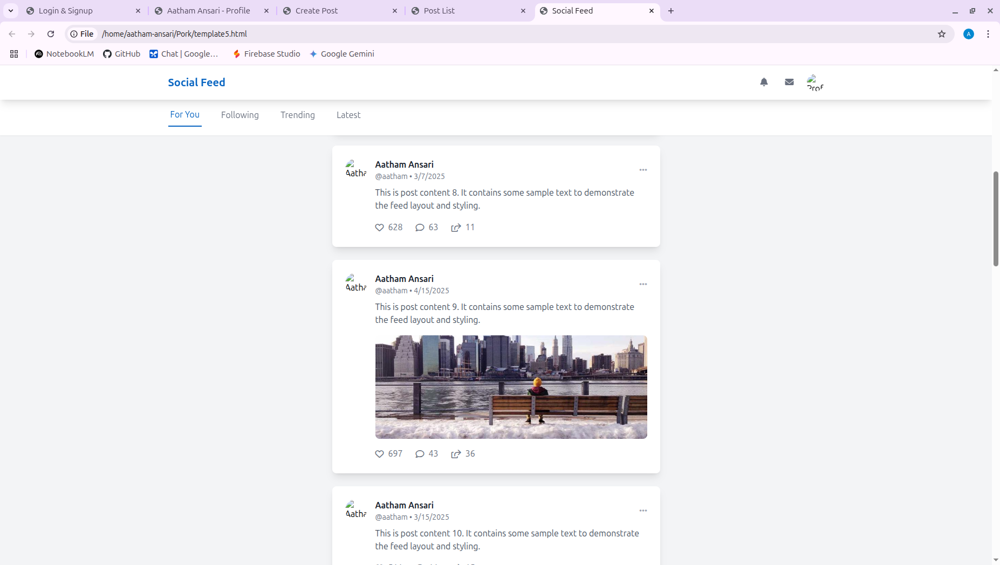
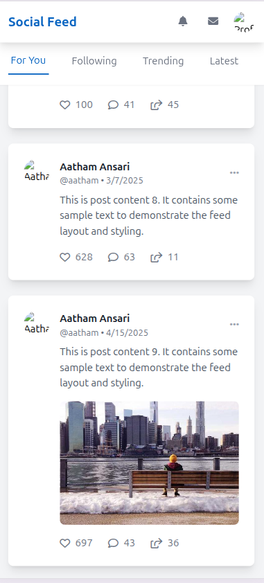

# Day 8: Basic Feed

## 🎯 Goal

Build the Basic Feed Display, integrating posts into a responsive layout.

## 📚 Learning Outcomes

- Create responsive feed layout
- Implement feed data management
- Design feed interaction patterns
- Handle real-time updates
- Implement feed optimization
- Create engaging user experience

## 🚀 Getting Started

Ensure your Day 7 Posts Listing is complete and tested. You should understand React state management and responsive design. The backend and frontend should be set up and running.

## 🛠️ Tasks

### Create and Switch to a New Branch

> **IMPORTANT:** Always create a new branch for each distinct piece of work.

```bash
# First, ensure you are on your 'main' branch and it's up-to-date
git checkout main
git pull origin main  # Get any potential updates from your own fork's main

# Now, create and switch to a new branch for this day's assignment/feature
git checkout -b day-8-basic-feed
```

> **What's happening?** You're creating an independent line of development for this day's tasks.

### Set Up Development Environment

#### Backend Virtual Environment (if not already active):

```bash
cd backend
source venv/bin/activate  # On Windows use: venv\Scripts\activate
```

#### Install Additional Dependencies:

```bash
pip install Flask Flask-SQLAlchemy Flask-Migrate
```

#### Frontend (already set up from previous days):

Ensure your frontend directory has all Node.js dependencies installed via `npm install`.

### Feed Implementation

#### Create Feed Container and Layout

- Design a responsive feed container
- Implement feed sections and navigation
- Add post components for displaying posts
- Implement loading and error states

### Data Management

#### Set Up Feed Data Structure

- Implement data fetching from backend
- Create data caching and refresh mechanism
- Handle real-time updates and error states

### User Experience

#### Enhance Feed Interactions

- Add pull-to-refresh functionality
- Implement smooth scrolling and loading animations
- Add error feedback and empty states
- Implement transition effects for feed updates

### Run the Application

```bash
# Start the backend server (in one terminal)
cd backend
flask run

# Start the frontend development server (in another terminal)
cd frontend
npm run dev
```

The application will be available at:

- Frontend: http://localhost:3000/feed
- Backend API: http://localhost:5000

### Testing

- Test feed layout and responsiveness
- Test data loading and refresh
- Test error handling and user interactions
- Test performance and smoothness

## 🔄 Git Workflow

### Develop and Save Your Progress

```bash
git add .
git commit -m "Day 8: Implement basic feed display and data management"
```

### Push Your Changes to Your Fork

```bash
git push -u origin day-8-basic-feed
```

### Merge After Completion

```bash
git checkout main
git pull origin main
git merge day-8-basic-feed
git push origin main
```

## 📸 Preview


## Preview




## Overview

## ✅ Deliverable

A responsive and engaging feed system with:

- Proper data management and caching
- Real-time updates and refresh
- Smooth user experience and transitions
- Clean, documented code
- All tests passing

## 🗂️ Folder Structure

```
08-basic-feed/
  README.md
  final/         # Your completed solution goes here
  backend/       # Flask backend code
    app.py
    requirements.txt
    routes/
      feed.py
    services/
      feed_service.py
    utils/
      cache.py
  frontend/      # React frontend code
    package.json
    src/
      components/
        Feed/
          FeedContainer.jsx
          FeedSection.jsx
          FeedNavigation.jsx
          PostCard.jsx
      hooks/
        useFeed.js
        useInfiniteScroll.js
      services/
        feed.js
```

---

If you have any questions or need help, feel free to open an issue or reach out to the instructor.
