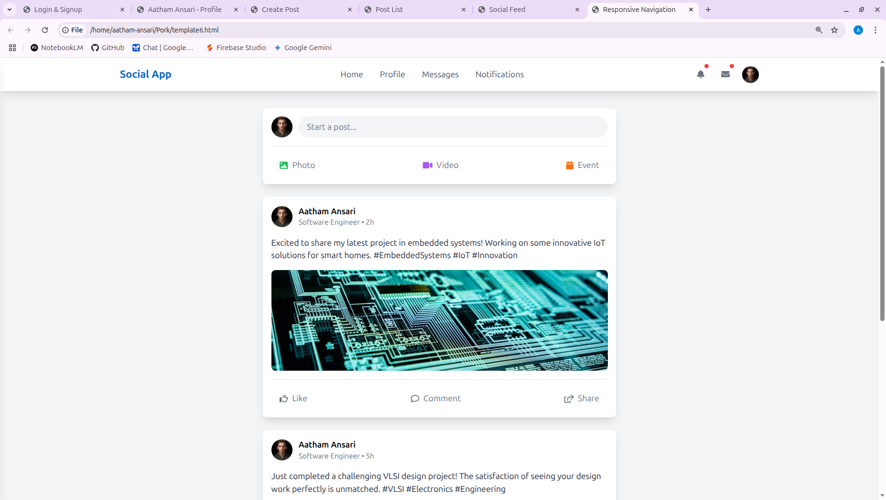
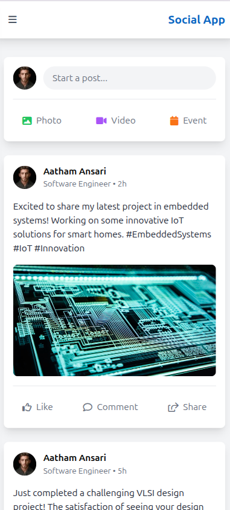
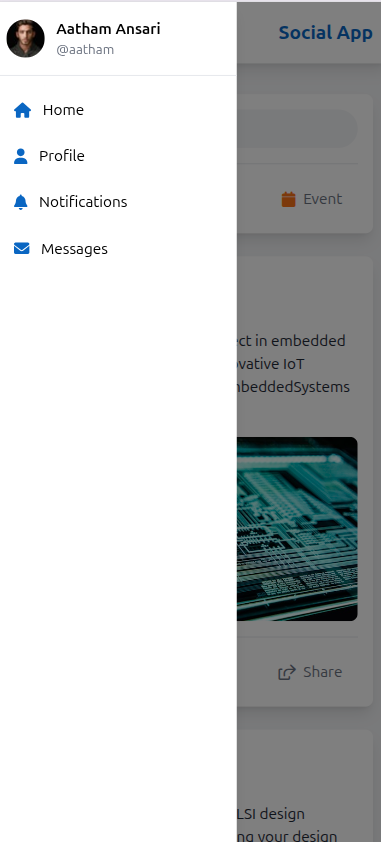

# Day 10: Navigation System

## 🎯 Goal

Develop the Comprehensive Navigation System (mobile hamburger, tablet, desktop horizontal) and integrate with existing features.

## 📚 Learning Outcomes

- Create responsive navigation components
- Implement different navigation patterns
- Design mobile-first navigation
- Handle navigation state
- Create smooth transitions
- Implement accessibility features

## 🚀 Getting Started

Ensure your Day 9 Feed Interactions is complete and tested. You should understand responsive design and React Router. The backend and frontend should be set up and running.

## 🛠️ Tasks

### Create and Switch to a New Branch

> **IMPORTANT:** Always create a new branch for each distinct piece of work.

```bash
# First, ensure you are on your 'main' branch and it's up-to-date
git checkout main
git pull origin main  # Get any potential updates from your own fork's main

# Now, create and switch to a new branch for this day's assignment/feature
git checkout -b day-10-navigation-system
```

> **What's happening?** You're creating an independent line of development for this day's tasks.

### Set Up Development Environment

#### Backend Virtual Environment (if not already active):

```bash
cd backend
source venv/bin/activate  # On Windows use: venv\Scripts\activate
```

#### Install Additional Dependencies:

```bash
pip install Flask Flask-SQLAlchemy Flask-Migrate
```

#### Frontend (already set up from previous days):

Ensure your frontend directory has all Node.js dependencies installed via `npm install`.

### Navigation Components

#### Create Main Navigation

- Design a responsive main navigation bar
- Implement mobile hamburger menu
- Add tablet and desktop navigation layouts
- Create sub-navigation and breadcrumbs

### Responsive Design

#### Implement Breakpoints and Layouts

- Set up breakpoints for mobile, tablet, and desktop
- Design mobile-first navigation with hamburger menu
- Style tablet and desktop navigation
- Add responsive transitions and handle orientation changes

### User Experience

#### Enhance Navigation Interactions

- Add smooth animations and transitions
- Implement active and hover states
- Create loading indicators and error states
- Implement feedback system for user actions

### Run the Application

```bash
# Start the backend server (in one terminal)
cd backend
flask run

# Start the frontend development server (in another terminal)
cd frontend
npm run dev
```

The application will be available at:

- Frontend: http://localhost:3000
- Backend API: http://localhost:5000

### Testing

- Test navigation across all breakpoints
- Test navigation flow and accessibility
- Test animations and transitions
- Test error handling and performance

## 🔄 Git Workflow

### Develop and Save Your Progress

```bash
git add .
git commit -m "Day 10: Implement comprehensive navigation system"
```

### Push Your Changes to Your Fork

```bash
git push -u origin day-10-navigation-system
```

### Merge After Completion

```bash
git checkout main
git pull origin main
git merge day-10-navigation-system
git push origin main
```

## 📸 Preview


## ✅ Deliverable

A fully responsive and accessible navigation system with:

- Mobile, tablet, and desktop layouts
- Smooth transitions and animations
- Proper error handling and feedback
- Clean, documented code
- All tests passing

## 🗂️ Folder Structure

```
10-navigation-system/
  README.md
  final/         # Your completed solution goes here
  backend/       # Flask backend code
    app.py
    requirements.txt
    routes/
      navigation.py
  frontend/      # React frontend code
    package.json
    src/
      components/
        Navigation/
          MainNav.jsx
          MobileNav.jsx
          TabletNav.jsx
          DesktopNav.jsx
          SubNav.jsx
          Breadcrumbs.jsx
      hooks/
        useNavigation.js
      services/
        navigation.js
```

## Preview





## Overview

---

If you have any questions or need help, feel free to open an issue or reach out to the instructor.
