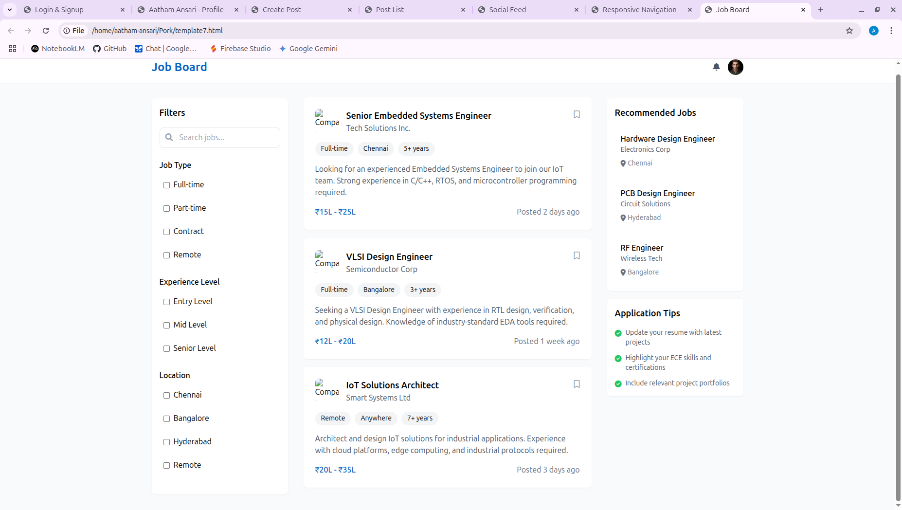
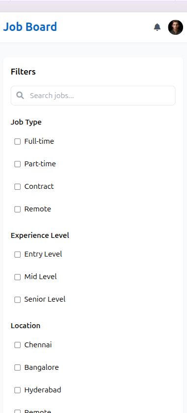

# Day 11: Job Board

## 🎯 Goal

Implement a basic Job Board with both job posting (for companies) and job search (for job seekers) functionality.

## 📚 Learning Outcomes

* Create job listing interface for job seekers.
* Implement basic job search functionality.
* Design simple job posting form for companies.
* Create basic job filtering system.
* Handle job application process.
* Implement company job management.

## 🚀 Getting Started

Ensure your Day 10 Navigation System is complete and tested. You should understand basic form handling and data management. The backend and frontend should be set up and running.

## 🛠️ Tasks

1.  **Create and Switch to a New Branch**
    > **IMPORTANT:** Always create a new branch for each distinct piece of work.

    ```bash
    # First, ensure you are on your 'main' branch and it's up-to-date
    git checkout main
    git pull origin main # Get any potential updates from your own fork's main

    # Now, create and switch to a new branch for this day's assignment/feature
    git checkout -b day-11-job-board
    ```

    > **What's happening?** You're creating an independent line of development for this day's tasks.

2.  **Set Up Development Environment**
    * **Backend Virtual Environment (if not already active):**
        ```bash
        cd backend
        source venv/bin/activate # On Windows use: venv\Scripts\activate
        ```
    * **Install Backend Dependencies:**
        ```bash
        pip install Flask Flask-SQLAlchemy Flask-Migrate
        ```
    * **Frontend (already set up from previous days):**
        * Ensure your `frontend` directory has all Node.js dependencies installed via `npm install`.

3.  **Job Board Implementation (Frontend & Backend)**
    * **For Job Seekers (Frontend):**
        * Create a job listing page showing available jobs.
        * Implement basic search functionality by job title and location.
        * Add simple filters (e.g., job type, location).
        * Create a job details view component.
        * Implement a basic application form for job submissions.
    * **For Companies (Frontend):**
        * Create a job posting form with fields for: Job title, Company name, Location, Job type (full-time, part-time, etc.), Description, Requirements, and Application deadline.
        * Add a simple company dashboard to: view posted jobs, edit job details, mark jobs as closed, and view basic application statistics.

4.  **Backend Implementation**
    * **Create Basic Models:**
        * Implement a Job model with essential fields (e.g., `id`, `title`, `company`, `location`, `description`).
        * Implement an Application model for job applications (e.g., `id`, `job_id`, `user_id`, `applicant_name`, `applicant_email`, `resume_link`).
    * **Implement API Endpoints:**
        * Create endpoints for job listing and search (e.g., `GET /api/jobs`).
        * Create endpoints for job posting and management (e.g., `POST /api/jobs`, `PUT /api/jobs/<id>`).
        * Create an application submission endpoint (e.g., `POST /api/jobs/<job_id>/apply`).
    * **Add Basic Validation:**
        * Implement validation for job posting data (e.g., required fields).
        * Implement checks for company permissions for managing jobs.
        * Validate application submissions (e.g., required applicant details).

5.  **Run the Application**

    ```bash
    # Start the backend server (in one terminal)
    cd backend
    flask run

    # Start the frontend development server (in another terminal)
    cd frontend
    npm run dev
    ```

    The application will be available at:

    -   Frontend: `http://localhost:3000/jobs`
    -   Backend API: `http://localhost:5000`

6.  **Testing**

    * Test job search and filtering functionality.
    * Test job posting form submission.
    * Test company dashboard for viewing and managing posted jobs.
    * Test the job application process.
    * Test basic error handling for all job board functionalities.

## 🔄 Git Workflow

1.  **Develop and Save Progress**

    ```bash
    git add .
    git commit -m "Day 11: Implement basic job board with company posting"
    ```

2.  **Push Your Changes to Your Fork**

    ```bash
    git push -u origin day-11-job-board
    ```

3.  **Merge After Completion**

    ```bash
    git checkout main
    git pull origin main
    git merge day-11-job-board
    git push origin main
    ```

## 📸 Preview




## ✅ Deliverable

A functional job board with:

* Working job search and basic filtering.
* Company job posting functionality.
* Simple company dashboard.
* Basic application process.
* Clean, documented code.
* All tests passing.

