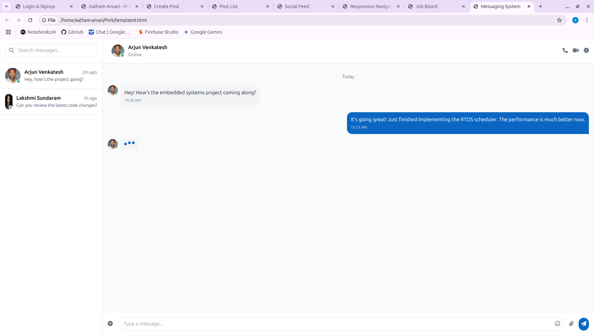
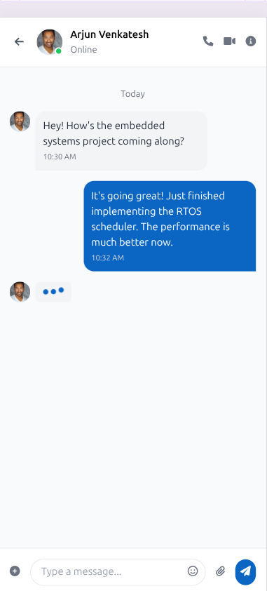
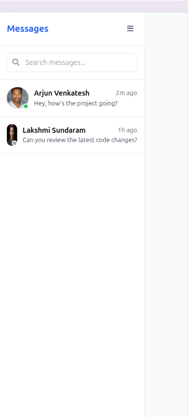

# Day 13: Messaging UI

## 🎯 Goal

Develop the Messaging UI (frontend) for basic chat functionality.

## 📚 Learning Outcomes

- Create real-time chat interface
- Implement message components
- Design conversation list
- Create message input system
- Implement typing indicators
- Handle message states

## 🚀 Getting Started

Ensure your Day 12 Second Deployment is complete and tested. You should understand WebSocket and real-time features. The backend and frontend should be set up and running.

## 🛠️ Tasks

### Create and Switch to a New Branch

> **IMPORTANT:** Always create a new branch for each distinct piece of work.

```bash
# First, ensure you are on your 'main' branch and it's up-to-date
git checkout main
git pull origin main  # Get any potential updates from your own fork's main

# Now, create and switch to a new branch for this day's assignment/feature
git checkout -b day-13-messaging-ui
```

> **What's happening?** You're creating an independent line of development for this day's tasks.

### Set Up Development Environment

#### Backend Virtual Environment (if not already active):

```bash
cd backend
source venv/bin/activate  # On Windows use: venv\Scripts\activate
```

#### Install Additional Dependencies:

```bash
pip install Flask-SocketIO python-socketio
```

#### Frontend (already set up from previous days):

Ensure your frontend directory has all Node.js dependencies installed via `npm install`.

### Chat Interface

#### Create Messaging Components

- Design and implement conversation list
- Create chat window component
- Add message bubbles with styling
- Implement message input system
- Add emoji support
- Create file sharing functionality

### Real-time Features

#### Implement WebSocket Integration

- Add typing indicators
- Implement read receipts
- Create online status system
- Add message status tracking
- Implement notification system
- Create message search functionality

### User Experience

#### Enhance Chat Experience

- Add smooth animations and transitions
- Create loading states and indicators
- Implement error handling system
- Add sound effects for notifications
- Create message action menu
- Implement message reactions

### Run the Application

```bash
# Start the backend server (in one terminal)
cd backend
flask run

# Start the frontend development server (in another terminal)
cd frontend
npm run dev
```

The application will be available at:

- Frontend: http://localhost:3000/messages
- Backend API: http://localhost:5000

### Testing

- Test chat interface functionality
- Test real-time features
- Test message states and delivery
- Test file sharing capabilities
- Test notification system
- Test responsive design

## 🔄 Git Workflow

### Develop and Save Your Progress

```bash
git add .
git commit -m "Day 13: Implement messaging UI with real-time features"
```

### Push Your Changes to Your Fork

```bash
git push -u origin day-13-messaging-ui
```

### Merge After Completion

```bash
git checkout main
git pull origin main
git merge day-13-messaging-ui
git push origin main
```

## 📸 Preview


## Preview





## Overview

## ✅ Deliverable

A fully functional messaging interface with:

- Working real-time chat
- Complete conversation management
- File sharing capabilities
- Notification system
- Responsive design
- Clean, documented code
- All tests passing

## 🗂️ Folder Structure

```
13-messaging-ui/
  README.md
  final/         # Your completed solution goes here
  backend/       # Flask backend code
    app.py
    requirements.txt
    routes/
      messages.py
    services/
      websocket.py
  frontend/      # React frontend code
    package.json
    src/
      components/
        Messages/
          ConversationList.jsx
          ChatWindow.jsx
          MessageBubble.jsx
          MessageInput.jsx
          TypingIndicator.jsx
      hooks/
        useMessages.js
        useWebSocket.js
      services/
        messages.js
```

---

If you have any questions or need help, feel free to open an issue or reach out to the instructor.
